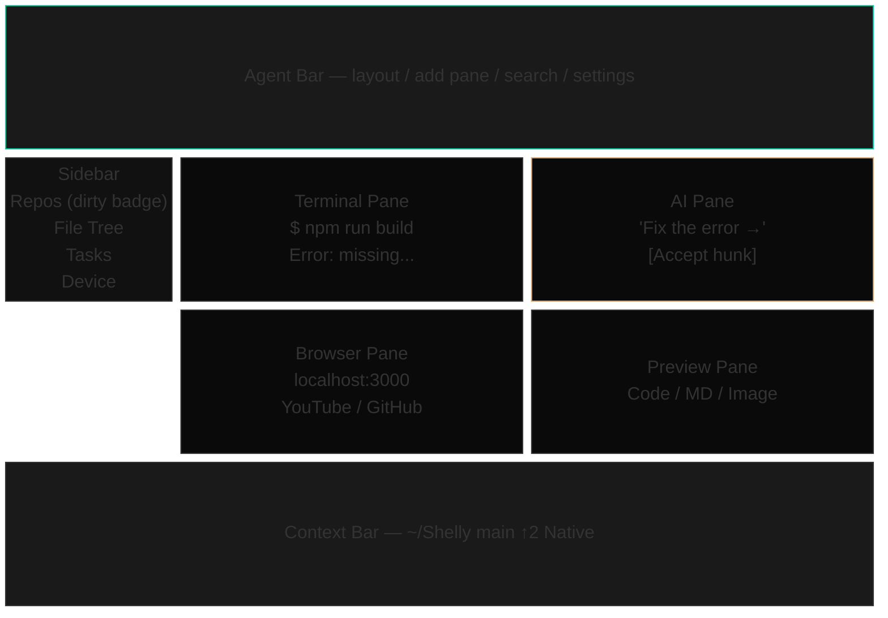
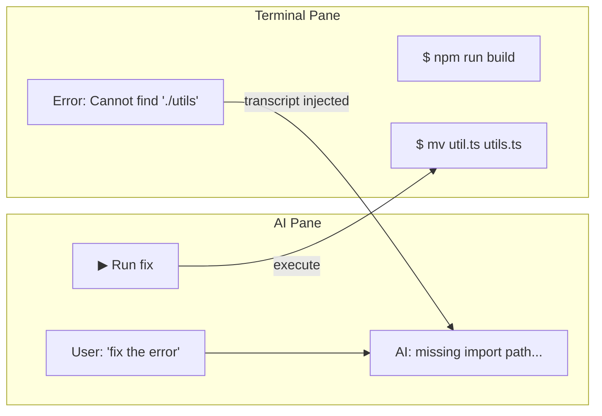
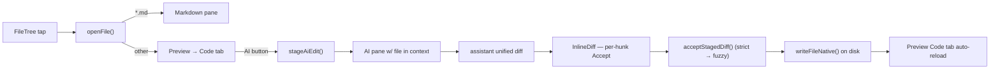
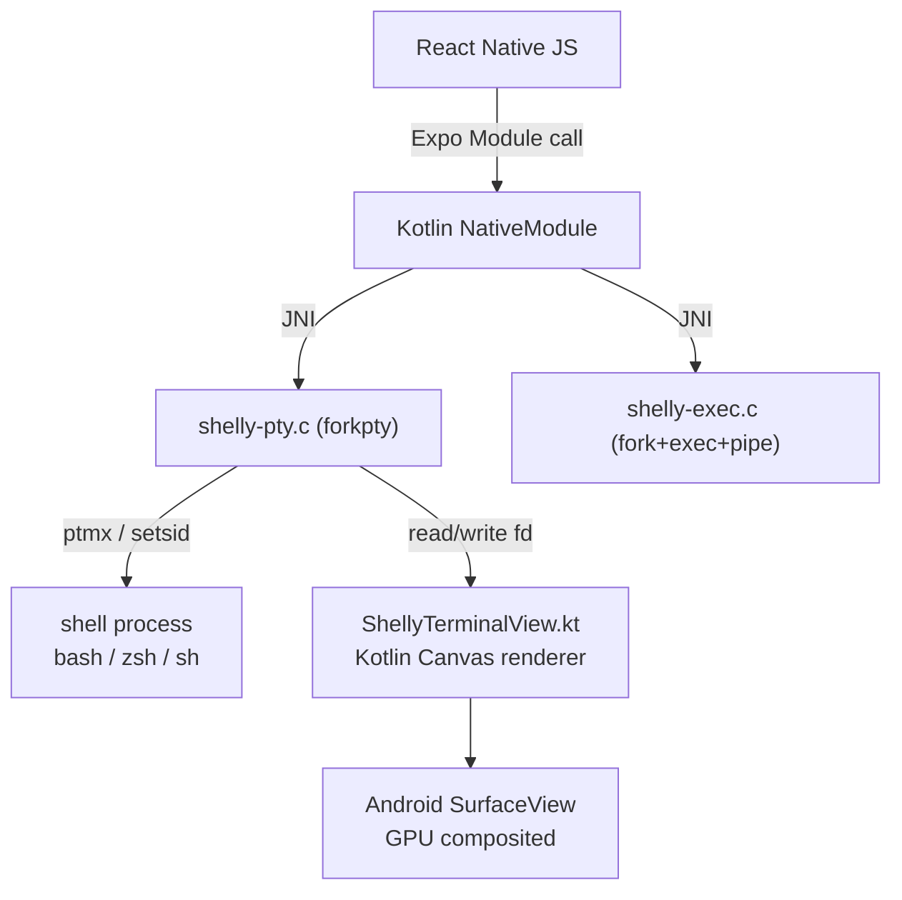
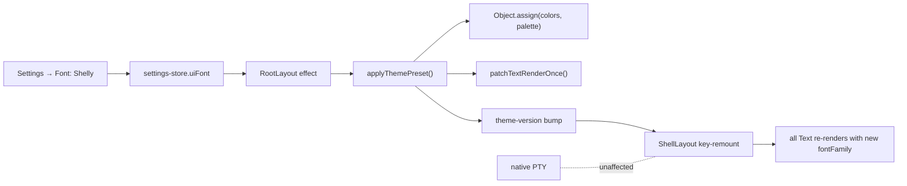

<p align="center">
  
</p>

<h1 align="center">Shelly</h1>

<h3 align="center">
  <code>Terminal + AI + Browser + Markdown + Preview</code><br>
  <sub>A full Android terminal IDE built around real interactive Claude Code and Codex CLIs, with API-backed Gemini, Groq, Cerebras, Perplexity, local models, Git, Bash, Python, and editors bundled in the APK.<br>
  No Termux install, no distro bootstrap, no separate package manager setup.<br>
  Open the app, authenticate your own AI accounts, and start working in local multi-pane terminals on Android.</sub>
</h3>

<p align="center">
  <a href="https://github.com/RYOITABASHI/Shelly/actions/workflows/build-android.yml"></a>
  
  
  
  
  
  <a href="https://buymeacoffee.com/ryo1221"></a>
</p>

<p align="center">
  
</p>

<p align="center">
  <a href="#see-it-run"><b>Demo</b></a> &nbsp;&middot;&nbsp;
  <a href="#quick-start"><b>Quick Start</b></a> &nbsp;&middot;&nbsp;
  <a href="#the-copy-paste-problem"><b>Why Shelly?</b></a> &nbsp;&middot;&nbsp;
  <a href="#features"><b>Features</b></a> &nbsp;&middot;&nbsp;
  <a href="#architecture"><b>Architecture</b></a> &nbsp;&middot;&nbsp;
  <a href="#status"><b>Status</b></a> &nbsp;&middot;&nbsp;
  <a href="#contributing"><b>Contributing</b></a> &nbsp;&middot;&nbsp;
  <a href="#support"><b>Support</b></a>
</p>


<br>

---

## See it run

**Claude Code running natively on Android with slash-command autocomplete**

<video src="https://github.com/RYOITABASHI/Shelly/raw/main/docs/videos/demo-claude-codex-2pane.mp4" controls width="100%"></video>

**AI reading a runtime error and suggesting the fix in real time**

https://github.com/user-attachments/assets/113ec26e-d289-4a06-a6d8-ef48158e874c

No Termux. No root. No remote dev server. Real Anthropic Claude Code and OpenAI Codex CLIs invoking on Android, plus an API-backed AI pane that reads terminal output and produces a one-tap fix.

<br>

---

## The Copy-Paste Problem

You're running an AI coding tool in a terminal — Claude Code, Codex, or any other CLI. It throws an error. You copy it. You switch to ChatGPT. You paste. You ask "what went wrong?" You read the answer. You copy the fix. You switch back. You paste. You run it.

**Seven steps. Every single time.**

This is the daily workflow of every developer using CLI-based AI tools. The terminal and the AI live in different worlds, and *you* are the copy-paste bridge between them.

**Shelly puts the terminal and the AI side by side. The AI reads your terminal output automatically.**

Say **"fix the error on the right"**. Shelly reads the terminal output, explains the error, and generates an executable command. Tap **[Run]** and the fix lands directly in the Terminal pane.

No copy. No paste. No tab switching. Zero friction.

**Three levels of value:**

- **Single pane:** a native terminal that is faster, smarter, and more usable than Termux alone — with inline content blocks, autocomplete, syntax highlighting, and clickable errors.
- **Split panes:** terminal + AI side by side — the AI reads what the terminal shows and executes fixes with one tap. No copy-paste bridge needed.
- **Full layout:** sidebar + up to 4 live panes + agent bar — a mobile IDE. Browse docs in the browser pane, preview code or markdown on the right, use API-backed agents in the background, and keep your terminal front and center.

---

## Why this APK is big, and what you're agreeing to

- **APK is ~420 MB** because Shelly bundles real tools, not shims. bash,
  Node.js, Python 3, git, curl, ripgrep, jq, tmux, vim, less, sqlite3,
  make, ssh — plus the Anthropic / OpenAI / Google AI CLI bundles — ship
  inside the APK. No Termux, no repository server, no package manager
  bootstrap. First launch extracts the binaries into app-private data.
- **All files access** is requested on first launch so `/sdcard` works
  the way a desktop terminal expects (`cd /sdcard/Download`, editing
  files there, etc.). Scoped Storage without this permission silently
  blocks writes. You can refuse — Shelly still works inside its own
  sandbox, but `/sdcard` paths will `Permission denied`.
- **LD_PRELOAD + /system/bin/linker64** is how Shelly runs Linux-layout
  binaries on Android bionic (SELinux blocks direct execve on
  app-private ELFs). The wrapper rewrites `/bin/X` and `/usr/bin/X` to
  `/system/bin/X` and routes app-bundled ELFs through `linker64`. Source
  is in `modules/terminal-emulator/android/src/main/jni/exec-wrapper.c`.
- **Not Termux-compatible by design.** Shelly does not use Termux
  packages, Termux paths, or Termux's prefix assumptions. If you already
  have Termux installed, Shelly still bundles its own copies of
  everything. No conflict, but also no sharing.

---

## Quick Start

Download the latest APK from [**GitHub Releases**](https://github.com/RYOITABASHI/Shelly/releases), or build from source:

```bash
git clone https://github.com/RYOITABASHI/Shelly.git && cd Shelly
pnpm install && pnpm android
```

> **Requirements:** Android device. For building from source: Node.js 22+, pnpm, Android NDK r27+. Expo Go is not supported — Shelly uses native Kotlin/C modules.
>
> Termux is not required. Shelly ships with bash, Node.js, Python 3, git, curl, sqlite3, tmux, vim, less, jq, make, and ripgrep. For tools beyond the bundled set, Termux can be used alongside Shelly.

On first launch Shelly asks for **All files access** so the terminal can read scripts in `/sdcard/Download` and anywhere else on your phone. Tap **Allow** and you're done — `source /sdcard/Download/foo.sh` just works. (Shelly is distributed via GitHub Releases and F-Droid, not Google Play, so this permission is fine here.)

After that, open **Settings → API Keys** (or run `shelly config` from the terminal pane) to paste API keys for Gemini, Cerebras, Groq, Perplexity, OpenAI-compatible local servers, or other explicit API providers. Keys are stored in `expo-secure-store` and never written to logs. Claude Code subscription access is used only through the interactive `claude` CLI that you control in a terminal pane; Shelly does not drive Claude Code as a hidden background worker.

### Sign in to the AI CLIs

Each CLI has a different login path on Shelly today. The TL;DR:

| CLI | How to sign in | Notes |
|---|---|---|
| **Claude Code** | Run `claude` in any terminal pane | Supported flagship CLI. Shelly uses the official Claude Code browser sign-in flow, seeds the home trust/onboarding state, opens auth URLs through the in-app Browser Pane when the CLI asks for sign-in, and keeps credentials under Shelly's app-private `$HOME` with private file modes. No already-logged-in donor account files are required for the normal path. |
| **Codex** (ChatGPT subscription) | Run `codex`, or `codex-login --open` directly | Supported flagship CLI. If `~/.codex/auth.json` is missing or invalid, the `codex` wrapper starts Shelly's device-code login, opens `auth.openai.com/codex/device` in the Browser Pane, writes `~/.codex/auth.json` (mode `0600`) on success, then launches the normal Codex TUI. |
| **Gemini CLI** | Experimental only | `gemini --version` and authenticated accounts are available for testing, but the interactive Gemini CLI has shown upstream Android/musl PTY instability. It is hidden from Worktrees and Quick Launch and is not part of Shelly's guaranteed launch surface. Use the Gemini API route in the AI Pane for production work. |

> **Codex login note.** `codex /login` inside the REPL is not the supported path on Shelly. Use bare `codex` and let Shelly's wrapper launch device-code auth, or run `codex-login --open` from bash.

Credential transplant is still documented below as a recovery path for power users, but the release path is now: Claude Code and Codex as supported terminal CLIs; Gemini through API-backed AI features, with Gemini CLI marked Experimental.

---

## Flagship Runtime

Shelly's headline advantage is simple: it makes Claude Code and Codex usable as first-class interactive CLIs on Android, inside the same native shell as your files.

If Claude Code stopped working in Termux, proot, or another Android terminal setup, Shelly gives you a maintained on-device environment designed around the constraints of real Android devices.

No fragile terminal stack. No WebView terminal crashes. No copy-paste-driven workflow.

- **Managed latest, not blind latest** — Shelly stages CLI candidates, verifies them, smoke-tests them on-device, promotes only passing builds, and keeps a last-known-good route when an upstream release breaks on Android.
- **Real execution path** — the CLIs run through Shelly's native terminal stack, not a remote bridge.
- **Visible state** — the app can show recent terminal logs, so version drift and startup failures are easier to debug on the device itself.
- **Compliance boundary** — Claude Code is a foreground, user-controlled terminal CLI. AI Pane/background automation uses explicit API providers; it does not silently reuse a Claude Code subscription or run Claude Code as a hidden service.

This is the part that makes Shelly more than a terminal skin. It is the reason the app can ship fast-moving CLI tools on Android without turning the user into the update mechanism.

### Release surface, May 2026

| Surface | Status | What that means |
|---|---|---|
| **Claude Code CLI** | Supported | Primary experience. Runs interactively in Terminal panes with Shelly-managed runtime selection, workspace trust seeding, account credentials in app-private storage, and crash-aware fallback tiers. |
| **Codex CLI** | Supported | Bare `codex` launches the normal Codex TUI after Shelly verifies or creates `~/.codex/auth.json` through in-app device-code auth. Current device validation shows `codex-exec 0.130.0` and GPT-5.5. |
| **AI Pane / background agents** | Supported through APIs | Uses configured providers such as Gemini API, Cerebras, Groq, Perplexity, local OpenAI-compatible servers, and explicit API routes. Claude Code subscription automation is intentionally disabled here. |
| **Gemini API** | Supported where configured | Available for AI Pane, voice/helper flows, and multimodal/API-backed tasks when a Gemini API key is configured. |
| **Gemini CLI** | Experimental | Bundled and patched for investigation, but upstream 0.42.x has shown blank TUI, slow PTY rendering, and shell-tool SIGSEGV behavior on Android/musl. It is not shown in Worktrees or Quick Launch for this release. |

---

## How is Shelly different?

Termux gives you a terminal but no AI-native workspace. ChatGPT gives you AI but no terminal. Replit runs in the cloud. Claude Code on desktop is desktop-first. To our knowledge, Shelly is the only tool that puts a native terminal and multi-agent AI side by side on your phone — with a browser pane, markdown viewer, code preview, sidebar, and agent bar all in one screen — and runs real Claude Code and Codex CLIs on-device so they operate in the same shell as your files.

---

## Features

> Everything listed in this section is working in the current build. Anything not yet shipped is listed under [Coming Soon](#coming-soon) further down.

### Highlights

| | |
|---|---|
| **Cross-pane intelligence** | Say "fix the error." AI reads your terminal, suggests a fix, one tap to run. Zero copy-paste. |
| **AI Edit golden path** | Tap a file in the sidebar → preview it → hit `[✨ AI]` → describe the change → accept per hunk → the file is rewritten on disk, the preview reloads automatically. |
| **Native PTY (JNI forkpty)** | Kotlin + C, same-process, zero IPC. The only React Native app we know of with an embedded native terminal. |
| **Batteries included** | bash, Node.js, Python 3, git, curl, sqlite3, tmux, vim, ripgrep, jq ship inside the APK. Termux not required. |
| **5 pane types** | Terminal, AI, Browser (+ background audio), Markdown, Preview. Split up to 4 live panes freely. |
| **Multi-agent AI** | API-backed Gemini, Cerebras, Groq, Perplexity, Local LLM, plus foreground Claude Code and Codex terminal CLIs. Auto-routed or `@mention` where supported. |
| **Claude Code + Codex on Android** | Shelly keeps the supported CLIs on managed latest paths without trusting upstream blindly. Claude Code uses staged runtime tiers with crash-aware cooldown and last-known-good fallback. Codex uses the smoke-tested `codex-exec` runtime and a Shelly-owned device-code login wrapper. Gemini CLI is bundled as Experimental, but release UX centers on Claude Code and Codex. No proot, no root. |
| **Shelly theme preset** | Mock-faithful teal-on-black palette with Silkscreen pixel font. Runtime swap — your shell survives the switch. |
| **Voice input** | Speak your commands or AI prompts. VoiceChain ties speech to the same input router the keyboard uses. |
| **CRT mode** | Scanlines + phosphor green + vignette. Retro 8-bit sounds. Pixel fonts. Just for fun. |

<details>
<summary><strong>Layout System</strong></summary>

- **Single-screen layout** — AgentBar (top) + Sidebar (left, collapsible) + PaneContainer (center) + ContextBar (bottom)
- **5 pane types** — Terminal (native PTY), AI (streaming + context injection), Browser (WebView + bookmarks + background audio), Markdown (viewer), Preview (Code / Image / PDF / CSV / Markdown renderers)
- **Recursive binary split tree** — any leaf can split horizontally or vertically, up to 4 live panes; drag the accent-green grip to resize, double-tap it to restore 50/50
- **Layout presets** — Single Terminal / Terminal + AI / Terminal + Browser / 3-Way Triple, all reachable from the Command Palette
- **Pane-type pill** — header left shows `[TERMINAL ▾]` / `[AI ▾]` / …; tap to change the pane type in place
- **CLI tab strip inside terminal panes** — multiple shell tabs per pane, `[● SHELL][+]`, close `×` on non-last tabs
- **Empty-pane recovery** — the last pane cannot be closed; if the tree ever empties, a 3-button CTA (Terminal / AI / Browser) brings it back
- **ContextBar** — always-visible footer showing cwd, git branch, and connection status

</details>

<details>
<summary><strong>Cross-Pane Intelligence</strong></summary>

- **"Fix the error on the right"** — AI reads the current terminal transcript and responds with executable fixes
- **ActionBlock** — code blocks in AI responses get `[▶ Run]` buttons that dispatch to the active terminal pane
- **Real-time terminal awareness** — AI pane snapshots the terminal transcript on dispatch so the model sees what you just saw
- **CLI Co-Pilot** — in-flight translation of output, approval prompt explanations, session summaries
- **Approval Proxy** — terminal `[Y/n]` prompts are lifted into chat-style `Approve / Deny / Ask AI` buttons so you never type blind 'Y'
- **Error Summary** — detected errors surface as persistent chat bubbles with `[Suggest Fix]`
- **Auto-savepoint** — every edit is auto-committed to a hidden git index so you can revert to any point with one tap
- **Pre-commit secret scan** — API keys, private keys, and other secrets are blocked before they land in a savepoint commit

</details>

<details>
<summary><strong>AI Edit — file edit with Accept / Reject</strong></summary>

- **Staged file** — tap a file in the FileTree; it opens in the Preview pane's Code tab. The `[✨ AI]` toolbar button stages the file in the AI pane's context.
- **Dispatch** — write "make the first function Japanese-comment" (or anything) and send. Shelly's system prompt asks the model to respond with a unified diff.
- **InlineDiff** — the assistant reply is scanned for unified diff blocks and each hunk is rendered with `+` / `-` / context coloring plus Accept / Reject buttons.
- **Per-hunk accept writes to disk** — accepting one hunk calls `acceptStagedDiff()` with a re-serialised single-hunk diff; the file is rewritten via the native `writeFileNative` bridge and the Preview pane auto-reloads.
- **Fuzzy re-anchor** — if the `@@ -N` line numbers are stale (because a previous hunk already edited the file on disk), the applier searches forward for the hunk's leading context block so successive hunks still land.
- **Accept All** — takes the same write-back path but applies every pending hunk in one pass.

</details>

<details>
<summary><strong>Terminal Enhancements</strong></summary>

- **Fig-style autocomplete** — top-level commands with subcommand and flag completion, rendered as an inline popup
- **Syntax highlighting** — terminal output colorized by content type
- **Clickable paths and errors** — tap a file path or stack trace line to jump to it
- **Inline content blocks** — JSON, markdown, images, and tables rendered inline inside the terminal output (Command Blocks)
- **CLI notifications** — long-running commands surface a system notification when they complete
- **SmartKeyBar** — 5 context-adaptive key sets (Default / Vim / Git / REPL / Navigate), swipe to switch
- **Immortal sessions** — tmux keeps your shell alive when the app is backgrounded; resume any session by name
- **Japanese input in terminal** — compose CJK characters directly in the terminal pane
- **Silkscreen-rendered glyphs** — native Kotlin terminal view renders the PTY grid in the same Silkscreen font as the rest of the UI
- **Atomic paste** — all paste paths converge on `TerminalEmulator.paste()`, which wraps payloads in bracketed-paste markers (`\e[200~..\e[201~`) unconditionally. IME multi-line or ≥16-char commits, middle-click mouse paste, and the CommandKeyBar **Paste** key all reach the same normalizer; multi-line and complex one-liners arrive as one event so readline executes only the trailing newline.

</details>

<details>
<summary><strong>AI Pane</strong></summary>

- **Multi-agent routing** — the router picks the best AI for the task; override with `@mention`
- **@mention** — `@gemini`, `@cerebras`, `@groq`, `@perplexity`, `@local`, `@team`, `@plan`, `@arena`, `@actions`; Claude Code and Codex remain available as foreground terminal CLIs instead of hidden background subscription workers
- **Terminal context injection** — the AI always has access to the current terminal transcript without you pasting anything
- **InlineDiff with per-hunk write-back** — see above
- **Voice input** — long-press the mic in the terminal action bar to open VoiceChat; speech → transcription → AI → TTS response
- **Arena Mode** — same prompt, two AIs, blind comparison; vote, then reveal
- **Local LLM support** — use the built-in GGUF catalog and llama.cpp / llama-server controls, then route via `@local` for fully on-device inference. The high-end recommendation is Qwen3-8B Q4_K_M; Qwen 2.5 1.5B remains the low-memory fallback.

</details>

<details>
<summary><strong>Browser Pane</strong></summary>

- **Full WebView** — navigate any URL inside a pane; keep docs open next to your terminal
- **Bookmarks** — save and organize URLs; preset icons for YouTube, X, GitHub, and `localhost:*`
- **Background audio** — audio keeps playing when you switch panes
- **Link capture** — share a URL to Shelly from any Android app; it opens in the browser pane
- **Desktop UA toggle** — `📱` / `🖥` button in the URL row swaps the user agent so desktop-only sites behave
- **Video fullscreen** — six detection paths (W3C / WebKit / video element / monkey-patched APIs) catch YouTube-style fullscreen and maximize the pane, hiding the system nav bar

</details>

<details>
<summary><strong>File Tree</strong></summary>

- **Active-repo file list** — `ls -1pa` listing for the current working directory with per-extension icon coloring (`.tsx` sky, `.ts` blue, `.json` amber, `README.md` red, …)
- **Search** — incremental filter over the current directory
- **Open actions** — tap a Markdown file to open the Markdown pane, tap anything else to open the Preview pane's Code tab
- **Create / Rename / Delete** — `+` file and `+` folder buttons next to the search field; long-press a row for `Rename / Copy path / Delete`; modals use Silkscreen and the Shelly palette
- **Breadcrumb** — tap the `..` row to go up

</details>

<details>
<summary><strong>Preview Pane</strong></summary>

- **Code tab** — per-file syntax-highlighted view with line numbers; the `[✨ AI]` button stages the current file for AI Edit
- **Markdown renderer** — `react-native-markdown-display` plus the Shelly palette
- **Image / PDF / CSV renderers** — inline viewers for common non-code attachments
- **Git diff view** — `git diff <file>` shown in the Code tab with neon `+` / `-` coloring
- **Recent files** — quick switcher inside the Preview header

</details>

<details>
<summary><strong>Sidebar</strong></summary>

- **Repositories** — list of bound repo paths; tap to switch; the active repo shows an amber badge with the number of uncommitted files, polled every 20 seconds from `git status --porcelain`
- **File Tree** — see above; embedded as a section so it flexes with the sidebar height
- **Tasks** — recent background-agent runs with duration and status
- **Device** — quick-access folders (`~`, `/sdcard/Download`, …) that re-bind the file tree in one tap
- **Ports** — every 15 seconds Shelly reads `/proc/net/tcp` and `/proc/net/tcp6` directly in-process (JNI fopen) and lists each loopback / wildcard listener; tap a row to open `http://localhost:<port>` in the Browser pane. Well-known ports get friendly labels (`:3000 NEXT.JS`, `:5173 VITE`, `:8081 EXPO`, `:8888 JUPYTER`, …).
- **Profiles** — saved SSH connections. Tap to insert `ssh -i KEY user@host -p PORT` into the active terminal pane; long-press to edit or delete; `Import from ~/.ssh/config` bulk-adds hosts. Key-file auth only — no passwords or passphrases are persisted.

> **Cloud storage?** Shelly deliberately doesn't ship a Google Drive / Dropbox / OneDrive UI. A terminal app should lean on the tools that already solve this — install [`rclone`](https://rclone.org) from your package manager, run `rclone config` once, and mount or sync any of 40+ cloud backends from the terminal pane.

</details>

<details>
<summary><strong>Command Palette</strong></summary>

Opens from the search icon in the top bar (or from the AgentBar's git badge). Fuzzy search across every registered action, plus a persistent **Recent** list of the last five you ran.

Currently registered:

- **Tabs** — Projects / Chat / Terminal / Settings
- **Terminal** — Clear / New session / Restore tmux / Tmux attach
- **Git** — Status / Diff / Log / Add all / Commit / Push / Pull --rebase *(routed through the active terminal pane's `pendingCommand` channel)*
- **Panes** — Add Terminal / AI / Browser / Markdown / Preview
- **Layouts** — Single Terminal / Terminal + AI / Terminal + Browser / 3-Way Triple
- **Font presets** — Shelly / Silk / 8bit / Mono
- **Cosmetics** — CRT toggle
- **Voice** — Open dialogue (VoiceChat modal)
- **Snippets** — first 20 entries from your snippet store, each dispatches to the terminal
- **Package Manager** — bundled tools status

</details>

<details>
<summary><strong>Theme &amp; Fonts</strong></summary>

- **"Shelly" preset** — new default. Mock-faithful palette with 8 neon accents (teal / green / blue / sky / purple / pink / amber / red) on a `#0A0A0A` background. Paired with Silkscreen.
- **Other presets** — Silkscreen (previous greener palette), 8bit (PressStart2P), Mono (system monospace), plus eleven classic editor palettes: **Dracula**, **Nord**, **Gruvbox**, **Tokyo Night**, **Catppuccin Mocha**, **Rose Pine**, **Kanagawa**, **Everforest**, **One Dark**, **Blackline** (pure black, low-distraction), and **Modal** (high-contrast modal ui theme). Switch from Settings → Display → Theme or the Command Palette.
- **Runtime swap** — presets are swapped by mutating the live `colors` object in place (identity preserved) and bumping a theme-version store that key-remounts the shell layout. PTY sessions survive the switch — your vim stays open.
- **Single-weight rendering** — every Text is forced through Silkscreen Regular regardless of its `fontWeight`. A two-weight mix (bold section headers against regular inline buttons) read as visibly inconsistent, so Shelly commits to one pixel weight everywhere.
- **Text.render monkey-patch** — `Text.defaultProps.style` is replaced (not merged) when a child passes its own `style`, which would otherwise let 100+ call sites escape the theme font. The patch prepends `{ fontFamily }` to every Text's style array so the preset font reaches every call site without touching them.
- **Neon glow** — eight per-color `textShadow` styles (teal / blue / sky / purple / pink / green / red / amber) for the mock's "reading terminal" vibe
- **CRT overlay** — scanlines + phosphor tint + vignette, backed by the cosmetic store
- **Haptic toggle** — per-interaction feedback on/off

</details>

<details>
<summary><strong>Git Integration</strong></summary>

- **Dirty badge** — AgentBar (amber pill, global) and Sidebar (on the active repo row) both show the uncommitted-file count, polled every 20 seconds by a single writer in `useGitStatusStore`. Tapping the AgentBar badge opens the Command Palette filtered toward git actions.
- **Command Palette** — the seven git actions listed above
- **Auto-savepoint** — background git-based save system (`lib/auto-savepoint.ts`) with secret pattern scanning before each commit
- **Git diff preview** — Preview pane Code tab renders `git diff <file>` with the neon diff palette

</details>

<details>
<summary><strong>Settings, API Keys, Background Agents</strong></summary>

- **Inline API key editor** — Gemini / Cerebras / Groq / Perplexity and local/OpenAI-compatible API keys in the Settings dropdown with masked display and per-row `EDIT / CLEAR / SAVE / CANCEL`. Keys live in `expo-secure-store`.
- **Settings TUI** — full settings also accessible via a terminal-style text UI
- **Command safety** — regex-based 5-level risk assessment (seatbelt, not firewall — see [Security](#security))
- **Workspace isolation** — per-project cwd / env / AI context
- **Background agents** — `@agent` schedule + AlarmManager-triggered runs under tmux through explicit API providers. Claude Code subscription/CLI background automation is intentionally disabled.
- **Managed CLI runtime updater** — `shelly-update-clis` downloads verified Claude extracted-runtime bundles and native Codex builds, verifies integrity, smoke-tests on-device, then hot-swaps `~/.shelly-runtime/<cli>/current` / `~/.shelly-cli` without an APK update. Gemini CLI candidates are still staged for Experimental testing, but are not promoted into the supported Worktree/Quick Launch surface. Runtime updates are serialized with `~/.shelly-runtime/.update.lock` so multi-pane launches cannot start duplicate downloads.
- **`shelly doctor`** — diagnostic command that checks PTY health, CLI binary presence, musl loader, resolv.conf, and credential state; run it when something feels broken

</details>

### Claude Runtime Tiers

- **Default:** extracted Node tier — Shelly extracts Claude Code's `cli.js`, runs it through the APK-bundled Node runtime, and applies the small Bun compatibility shims Claude currently expects.
- **Experimental:** native musl Bun SEA tier — set `SHELLY_PREFER_NATIVE_CLAUDE=1` to try the staged linux-arm64 musl Bun binary. If that version has recently crashed on the device, Shelly skips it and keeps the extracted Node route.
- **Debug escape hatch:** `SHELLY_FORCE_NATIVE_CLAUDE=1` bypasses the cooldown and forces the native tier for investigation only.
- **Runtime learning:** foreground native crashes are recorded, converted into a 24-hour cooldown, and combined with updater-side `--version` smoke checks before any new native candidate is promoted.
- **Overrides:** `SHELLY_FAILED_VERSION_COOLDOWN` controls cooldown seconds (default `86400`), `SHELLY_NATIVE_VERSION_SMOKE_RUNS` controls native `--version` smoke count (default `3`), and `SHELLY_STAGING_GC_AGE_S` controls stale staging GC age (default `86400`).

---

## Status

| Area | State |
|---|---|
| Native PTY, sessions, tmux revival | ✅ shipping |
| Multi-pane layout (5 types, splits, presets, drag resize, empty-state CTA) | ✅ shipping |
| Atomic paste (bracketed-paste wrap when guest opts in via DECSET 2004, single `TerminalEmulator.paste()` choke point, IME chunk-split coalesced) | ✅ shipping (bugs #91, #94, #97, #106) |
| `/sdcard` access via `MANAGE_EXTERNAL_STORAGE` (first-launch grant flow) | ✅ shipping (bug #92) |
| `bash` wrapper at `$HOME/bin/bash` for shebangs and `bash script.sh` | ✅ shipping (bug #93) |
| `execSubprocess` JNI read loop (EAGAIN vs EOF distinction) | ✅ shipping (bug #70) |
| AI Edit golden path (stage → diff → per-hunk accept → disk writeback) | ✅ shipping, fuzzy re-anchor for successive hunks |
| FileTree CRUD (create / rename / delete / copy path) | ✅ shipping |
| Command Palette — tabs, terminal, git, panes, layouts, font, CRT, voice | ✅ shipping |
| Browser fullscreen, desktop UA toggle, link capture, bookmarks | ✅ shipping |
| Theme presets — Shelly / Silkscreen / 8-bit / Mono + Dracula / Nord / Gruvbox / Tokyo Night / Catppuccin Mocha / Rose Pine / Kanagawa / Everforest / One Dark / Blackline / Modal (runtime swap, single-weight Text monkey-patch) | ✅ shipping |
| AgentBar + Sidebar git dirty badge (single-writer poll) | ✅ shipping |
| Sidebar Add Repository existence check + Alert on ghost path | ✅ shipping (bug #73) |
| AI pane Local LLM routing (URL-driven, no enable toggle) | ✅ shipping (bug #68) |
| Voice dialogue (VoiceChat + VoiceChain + TTS) | ✅ implemented, device smoke-test pending |
| Immortal sessions (tmux keep-alive) | ✅ implemented, device smoke-test pending |
| Local LLM via llama.cpp `@local` (Settings · Integrations · Local LLM: catalog, download, start/stop) | ✅ shipping |
| MCP Servers (Settings · Integrations · MCP Servers) | ✅ shipping |
| Claude Code and Codex CLI launch/auth | ✅ supported; Claude Code runs as a user-controlled terminal CLI, Codex uses Shelly device-code auth before TUI launch |
| Claude Code extracted Node tier with Bun compatibility shims + experimental updater-managed musl Bun SEA tiers behind `SHELLY_PREFER_NATIVE_CLAUDE=1` / `SHELLY_FORCE_NATIVE_CLAUDE=1` + native crash cooldown + raw-syscall LD_PRELOAD wrappers + legacy npm fallback + Codex CLI verified native runtime | ✅ managed latest with rollback; current device validation covers Claude Code 2.1.14x and Codex 0.130.0 |
| Gemini API in AI Pane / helpers | ✅ available when configured |
| Gemini CLI interactive TUI | ⚠ Experimental only; bundled for testing, hidden from Worktrees / Quick Launch due to upstream Android PTY instability |
| Arena mode | ✅ wired, under-used — let us know how it feels |
| Background agents — `@agent` registration, AlarmManager scheduling, Sidebar Tasks list with run-now / delete | ✅ wired, AlarmManager end-to-end smoke test pending |
| Sidebar Ports monitor (`/proc/net/tcp` → tap to open in Browser pane) | ⚠ Android 10+ SELinux denies both `/proc/net/tcp{,6}` reads and `NETLINK_SOCK_DIAG` sockets from `untrusted_app`; tracked in `docs/superpowers/DEFERRED.md` (P1) — needs an alternative channel (e.g. a bundled privileged helper or system_server intent) in a future release |
| Sidebar SSH Profiles (key-file auth, ~/.ssh/config import, tap-to-connect) | ✅ shipping |
| Sidebar Quick Launch / Worktrees (one-tap CLI shortcuts) | ✅ shipping for Claude Code and Codex; Gemini removed from this surface for the release |
| Cloud storage | 🚫 out of scope — use `rclone` from the terminal pane |
| App icon | ✅ shipping |
| Distribution channels (Play Store / F-Droid) | 🟡 GitHub Releases only for now |

Full validation checklist: [`docs/superpowers/specs/2026-04-13-validation-checklist.md`](docs/superpowers/specs/2026-04-13-validation-checklist.md)

---

## Coming Soon

Parts of the app are written but not yet verified. These are on the short-term roadmap, not in the current build:

- **Play Store / F-Droid distribution** — the APK is published via GitHub Releases only; store submission flow not yet done
- **End-to-end device validation** for voice dialogue, immortal sessions, and background agent AlarmManager scheduling — all wired but not yet smoke-tested on the target device
- **Snippet authoring UI** — the Command Palette shows the first 20 entries from your snippet store and dispatches them to the terminal, but the in-app create/import/edit flow was removed in an earlier cleanup pass. Snippets can still be added by editing `~/.shelly/snippets.json` directly or via `shelly config`.

---

## The Story

### I don't hand-write code.

I'm not an engineer by training — I'm a Creative Director. Every line in this repo was generated by AI under my direction, then reviewed, tested on-device, and shipped. What I bring is twenty years of product judgment about what belongs on a screen and what doesn't — and that turns out to be most of the job.

Every architectural decision in Shelly is mine. The code is not. It was created through conversation with [Claude Code](https://claude.ai/) on a Samsung Galaxy Z Fold6. I direct. The AI builds. No desktop. No laptop. Just a foldable phone and an AI that can execute commands.

The keyboard you see in the screenshots? I built that too. It's called [Nacre](https://github.com/RYOITABASHI/Nacre) — an Android IME written in Kotlin, also created entirely through AI conversation. I'm typing on it right now, inside Shelly, improving both apps simultaneously.

This is not a portfolio project. This is a tool I use every day to build things. If you find something that could be better, that's what the issue tracker is for.

### Why any of this exists

Mobile development never took off — not because phones lack computing power, but because the **input** and **interface** weren't designed for creation.

Chat apps (ChatGPT, Claude, Gemini) can *talk* about code, but they can't *run* it. Terminal emulators (Termux) can *run* anything, but they're hostile to anyone who isn't already a developer.

Shelly fills the gap. You type "make me a portfolio site" in the AI pane, and a real shell runs the commands, generates files, and shows you the results — right next to the terminal that produced them.

### Why every design decision is shaped like a question

Every feature in Shelly started as a frustration I had with existing tools:

- The cross-pane system comes from *"Why do I have to copy an error from one window and paste it into another?"*
- The native terminal comes from *"Why does the terminal die every time I switch apps?"*
- The approval proxy comes from *"Claude is asking me to approve something in English. I don't know what it means."*
- The VoiceChain comes from *"I can't type on a phone keyboard fast enough to keep up with my ideas."*
- The layout system comes from *"Why can't I have a browser, a terminal, and an AI all on the same screen at the same time?"*
- The Shelly theme preset comes from *"Why do I have to choose between a usable UI and an aesthetically interesting one?"*

Every limitation became an innovation that engineers need just as much.

### Why native — the WebView pivot

Early versions used ttyd and a WebView. WebSocket connections dropped. Android's Phantom Process Killer terminated background processes. Every time you switched apps, the terminal was dead.

So I directed the AI to throw it all away and go native. Shelly now embeds a native terminal emulator — Kotlin code derived from Termux's own `terminal-emulator` library — connected via a JNI C layer that calls `forkpty()` in the same process. No TCP. No IPC boundary. No socket drops.

As far as we know, this is the **only React Native app in the world** with an embedded native terminal emulator running in-process via JNI.

### Who is this for?

- **Vibe Coders** — Lovable / Bolt / Replit Agent, but on your phone with a real terminal underneath
- **Mobile-first developers** — Claude Code and Codex CLI users who want a proper multi-pane IDE around real local terminals
- **Non-engineers with ideas** — Shelly translates everything. Dangerous operations are blocked until you understand them

---

## Architecture

### Screen Layout



### Cross-Pane Intelligence



AI reads Terminal. Terminal executes AI. The user just talks.

### AI Edit Golden Path



Each step is a real module: `lib/open-file.ts`, `lib/ai-edit.ts`, `components/panes/InlineDiff.tsx`, `hooks/use-native-exec.ts`.

### Native PTY — JNI forkpty



Two JNI entry points for two different needs. **`shelly-pty.c`** owns interactive shells: it opens `/dev/ptmx`, calls `forkpty`-equivalent logic (`grantpt` + `unlockpt` + `setsid` + `execve` via `/system/bin/linker64`), and hands the master fd back to Kotlin for the terminal view to read. **`shelly-exec.c`** owns programmatic one-shots (`git status`, `ls`, file I/O, AI dispatch helpers): it does a vanilla `fork` + `exec` + `pipe` and returns `{exitCode, stdout, stderr}` synchronously, with an EAGAIN-aware read loop that distinguishes spurious select wakes from genuine EOF (bug #70 fix).

No TCP. No sockets. No separate process. Shells run as children of the app process, and the PTY fd is read directly from Kotlin via JNI.

### Runtime Theme Swap



The `colors` object is mutable and keeps the same identity, so every `import { colors as C }` consumer sees the new values without a code change. The Text monkey-patch handles font changes. The theme-version key-remount forces all rendered Text through the patch. PTY lives outside JS, so it's untouched.

---

## Built With

| Layer | Technology |
|-------|-----------|
| Framework | Expo 54 / React Native 0.81 |
| Language | TypeScript (strict) + Kotlin + C |
| UI | NativeWind (TailwindCSS 3) |
| State | Zustand |
| Navigation | expo-router v6 |
| Terminal | Native emulator (Kotlin, Termux-derived) + JNI forkpty (C, same-process) |
| Fonts | Silkscreen (single weight, via `@expo-google-fonts/silkscreen`) + PressStart2P + system monospace |
| i18n | expo-localization + Zustand (900+ keys, EN/JA) |

---

## Contributing

This started as a personal tool. Community contributions are shaping it into a true OSS project.

**Looking for a first contribution?** Check the [`good first issue`](https://github.com/RYOITABASHI/Shelly/issues?q=is%3Aissue+is%3Aopen+label%3A%22good+first+issue%22) label:

- [Set up Jest test framework](https://github.com/RYOITABASHI/Shelly/issues/5) — foundational, unblocks all test work
- [Add unit tests for input-router.ts](https://github.com/RYOITABASHI/Shelly/issues/1) — pure functions, easy to test
- [Add unit tests for command-safety.ts](https://github.com/RYOITABASHI/Shelly/issues/2) — security-critical, great for TDD
- [Add unit tests for auto-savepoint.ts](https://github.com/RYOITABASHI/Shelly/issues/3) — git operations, secret detection
- [Translate Japanese code comments to English](https://github.com/RYOITABASHI/Shelly/issues/4) — one file per PR is fine
- [Flesh out CONTRIBUTING.md](https://github.com/RYOITABASHI/Shelly/issues/6) — development setup guide

**Key files to explore:**

- `lib/input-router.ts` — the brain; classifies natural language into shell commands, AI requests, or `@mentions`
- `lib/command-safety.ts` — risk assessment engine; blocks dangerous commands with 5 severity levels
- `lib/auto-savepoint.ts` — watches for file changes and auto-commits; the "game save" system
- `lib/ai-edit.ts` — stage / apply / fuzzy-re-anchor unified diffs against the staged file
- `lib/theme-presets.ts` — palette + runtime preset swap + Text.render monkey-patch
- `components/panes/InlineDiff.tsx` — per-hunk Accept / Reject with write-back
- `modules/terminal-view/android/.../ShellyTerminalView.kt` — the native terminal renderer (Kotlin + Android Canvas)
- `modules/terminal-emulator/android/src/main/jni/shelly-pty.c` — the JNI forkpty layer

If you find something that could be better — a cleaner pattern, a performance optimization, a bug fix — **please open an issue or PR**. That's exactly why this is open source.

Read the contributing guide: **[CONTRIBUTING.md](CONTRIBUTING.md)**

---

## Vision

In two years, mobile terminals will be standard. The hardware is already here — 40+ TOPS NPUs, 12 GB of RAM, 7B-parameter models running on-device at interactive speeds — and the only thing missing is the interface. Shelly is a bet on that timeline.

When a full IDE runs in your pocket and the AI doesn't have to phone home, you get zero-cost assisted development, complete privacy, and the ability to ship real software from places no laptop reaches. The first person to ship a production app from a plane without wifi will be using something like this.

Shelly was built for that future. Local LLM routing is already wired. The native terminal is already there. The multi-agent routing already supports local models alongside cloud APIs. The layout system already handles the screen real estate of foldables and tablets.

The question isn't whether mobile development will happen. It's who builds the tools for it first.

---

## About the Creator

**RYO ITABASHI** — Creative Director at [Rebuild Factoryz](https://rebuildfactoryz.com/). Branding and design are my profession. Code is not.

I built Shelly because I wanted to use Claude Code on my phone, but Termux was too intimidating. So I made a chat interface that hides the terminal complexity while keeping its full power. Then I realized the real problem wasn't the terminal itself — it was the gap between the terminal and the AI. So I connected them. Then the WebView kept dying, so I directed the AI to replace the entire rendering layer with a native terminal emulator. Then I realized I needed a browser pane, a markdown viewer, a code preview, a sidebar, and a proper layout system to make it a real IDE.

I still don't hand-write code. I describe what I need, the AI builds it, and I decide whether it ships.

The keyboard in the screenshots is **Nacre** — a split-layout Android IME I built (also through AI) to solve the input problem on mobile. Shelly handles the interface. Nacre handles the input. Together, they make phone-only development actually possible.

**Both were developed entirely on a Samsung Galaxy Z Fold6, without ever touching a desktop computer.**

---

## Support

Shelly is a solo, self-funded project. If it saves you a Termux setup or makes phone development viable for you, a coffee goes a long way.

<p align="center">
  <a href="https://buymeacoffee.com/ryo1221"></a>
</p>

You can also support the project by:

- ⭐ Starring this repo
- 🐛 [Reporting bugs](https://github.com/RYOITABASHI/Shelly/issues)
- 🔧 Sending a PR — see [Contributing](#contributing)
- 💬 Sharing what you built with Shelly

GitHub Sponsors is also enabled via the "Sponsor" button at the top of this repo.

---

## Known Limitations

Shelly v5.3.1 is pre-release Android software. Here's what we know isn't perfect yet.

- **No offline mode by default** — Cloud AI features require an internet connection. Local LLM via `@local` works offline with the bundled catalog and llama.cpp / llama-server controls; Qwen3-8B Q4_K_M is recommended for high-end foldables, while Qwen 2.5 1.5B is the low-memory option.
- **Additional tools beyond the bundle** — Shelly ships with bash, Node.js, Python 3, git, curl, sqlite3, tmux, vim, less, jq, make, and the GNU coreutils set. Notable tools **not** bundled include `busybox`, `watch` (procps-ng), `htop`, and most network daemons. If you need them, install Termux alongside Shelly or open a PR adding the binary to `modules/terminal-emulator/android/src/main/jniLibs/`.
- **`watch` is broken in the current release** — the bundled `watch` binary fails to invoke subcommands under Shelly's bionic environment and the watched command never actually runs, even though the header refreshes. Workaround: `while true; do clear; <cmd>; sleep 1; done`. Tracked as bug #34.
- **`busybox` is not bundled** — `busybox httpd`, `busybox nc`, and other applets return `command not found`. Use the standalone equivalents where available (`curl`, `nc` from the bundle, `python3 -m http.server`), or bundle `busybox-static` yourself. Tracked as bug #35.
- **`@team` routes to multiple APIs simultaneously** — this consumes credits on every provider at once; a cost warning is shown before execution.
- **Multi-hunk Accept against a partially-edited file** — per-hunk Accept uses fuzzy re-anchoring so successive hunks land, but if the AI's diff references context that has already been edited to something else, the hunk will be rejected with a toast asking you to regenerate.
- **Silkscreen is not monospaced** — `ls -la` columns may drift slightly; switch to the `Mono` font preset from the Command Palette if you need strict columns.
- **Codex CLI runs through Shelly-managed runtime routing** — `@openai/codex` can ship native binaries Android cannot execute directly. Shelly stages the npm dispatcher, applies the compatibility hook, and prefers the smoke-tested `codex-exec` runtime under `~/.shelly-runtime/codex/current`. Current device validation shows `codex-exec 0.130.0` and the Codex TUI starting on GPT-5.5. If `codex --version` fails, run `shelly doctor` or check `~/.shelly-cli/install.log` / `~/.shelly-runtime/update.log`.
- **Codex login uses an in-app device-code OAuth flow** — run bare `codex` or `codex-login --open` from any terminal pane. Shelly validates `~/.codex/auth.json`; if it is missing or invalid, Shelly drives device auth against `auth.openai.com`, opens the verification page in the in-app Browser Pane via the file-queue deep-link bridge, writes `~/.codex/auth.json` (mode `0600`) on success, then launches the normal Codex TUI. No OpenAI API key is required; this rides your ChatGPT Plus/Pro/Business/Enterprise subscription. The flow has a 15-minute device-code timeout — re-run if it expires. Verify with `shelly doctor` (look for the `codex auth:` line). Implemented in `modules/terminal-emulator/android/src/main/assets/shelly-codex-auth.js`.
- **`/sdcard` access requires MANAGE_EXTERNAL_STORAGE** — Android 11+ Scoped Storage blocks direct `open(2)` on `/sdcard` paths without this permission. Shelly asks for it on first launch; if you deny it, `source /sdcard/Download/foo.sh` will fail with `Permission denied`. Re-grant from system Settings → Apps → Shelly → Permissions → Files and media → Allow management of all files.
- **Claude Code login and workspace trust** — Shelly has passed device validation for interactive Claude Code startup through the official browser sign-in flow, with app-private credentials and home trust seeded (`trust=true`, hooks enabled, onboarding complete). You do not need to import an already-logged-in account for the normal path. If Anthropic changes the CLI login flow, `shelly-doctor` and the Recent Logs view are the first places to check.
- **Gemini CLI is experimental** — Gemini API support remains in the AI Pane, but the interactive `gemini` CLI is not a supported launch promise. Recent 0.42.x testing on Android showed intermittent blank TUI startup, very slow responses, and shell-tool commands terminating with signal 11. The bundle and patcher stay in the APK for investigation; Worktrees and Quick Launch do not expose Gemini for this release.
- **Very large or binary pastes** — the paste path is a one-shot write into the PTY. Multi-megabyte clipboard payloads will take noticeable time and may stall the UI briefly; binary content (non-UTF-8 bytes, null characters) is not a supported transport mechanism and may corrupt the shell buffer. Use `curl -O` / `scp` / `/sdcard/Download/` drop-point for binary transfer.
- **Fold/rotate/split-screen during an active CLI session** — Shelly survives layout changes, but terminal state is not always persisted across an Android Activity recreate. Save or commit work before aggressive multitasking (fold ↔ unfold rapidly, split-screen drag while a foreground job is running). AI CLI streams specifically are best completed or interrupted (Ctrl-C) before rotating.

### Bring your own credentials

Shelly's normal release path is in-app authentication for Claude Code and Codex. Credential transplant remains useful when you have already authenticated elsewhere and want to mirror the same credentials onto the phone, or when an upstream OAuth change temporarily breaks the in-app flow. Finish authentication on a machine where it works (Termux, PC, Codespaces), then copy the resulting credential files onto the phone via `/sdcard/Download/` and unpack them into Shelly's home directory.

#### Claude Code

Claude Code stores its authentication in two files on whatever machine you ran `/login` on:

- `~/.claude.json` — account + onboarding completion state (~32 KB)
- `~/.claude/.credentials.json` — OAuth access + refresh tokens (~500 B)

Both need to land in the corresponding paths inside Shelly's home directory. The shortest route is `/sdcard` as a shared drop point:

**On the working machine** (Termux, laptop, Codespaces, …) after a successful `/login`:

```bash
# Drop both files onto shared storage. On desktop, use scp/rsync/adb push
# to put them under /sdcard/Download/ on the phone instead.
cp ~/.claude.json                /sdcard/Download/shelly-claude-root.json
tar cf  /sdcard/Download/termux-claude-dir.tar -C ~/.claude .
# If your tar defaults to gzip, use `tar cf` (no `z`) — Shelly's bundled
# tar cannot exec /bin/zcat and will fail on tar.gz.
```

**On Shelly**, in a terminal pane:

```bash
cp /sdcard/Download/shelly-claude-root.json ~/.claude.json
chmod 600 ~/.claude.json
cd ~/.claude && tar xf /sdcard/Download/termux-claude-dir.tar
claude              # "Welcome back <you>" means success; an onboarding picker means a file is missing
```

Caveats:

- Access tokens are short-lived (~9 hours). When the refresh token eventually rotates or Cloudflare's WAF rejects an Android-origin refresh, Shelly's `claude` will stop authenticating and you'll need to repeat the copy from a working environment. The community has reported refresh failures in [anthropics/claude-code#47754](https://github.com/anthropics/claude-code/issues/47754); we have not yet seen it in Shelly testing, but it is the expected long-tail failure mode.
- The donor machine's `claude` version does not matter for credential transplants — **any version** of claude-code produces compatible `~/.claude.json` and `.credentials.json` files. Shelly's default Claude route now runs the latest extracted Bun `cli.js` with bundled Node, with the musl SEA and legacy `cli.js` tiers kept as fallbacks, so no pinning is needed on either side.
- These files are highly sensitive (anyone holding them can talk to Anthropic as you). Treat the `/sdcard/Download/` copies as single-use — delete them after the transplant lands.

#### Gemini CLI

Gemini CLI is experimental in this release. Gemini API is the supported Gemini path for AI Pane/background use. If you still want to test the interactive CLI, Gemini stores everything under a single directory — no `$HOME`-level file like Claude's `~/.claude.json`. Size is small (~110 KB tarred) so the transplant is trivial.

**On the working machine** (after `/auth` completes):

```bash
tar cf /sdcard/Download/termux-gemini-dir.tar -C ~/.gemini .
```

**On Shelly**:

```bash
mkdir -p ~/.gemini
cd ~/.gemini && tar xf /sdcard/Download/termux-gemini-dir.tar
gemini              # "Signed in with Google" → interactive prompt, no trust picker
```

Key files inside `~/.gemini/`:

- `oauth_creds.json` — Google OAuth access + refresh tokens
- `google_accounts.json` — account linkage
- `trustedFolders.json` — skips the first-run trust picker once your workspace path is listed
- `settings.json`, `state.json`, `projects.json` — preferences and history

Caveats:

- Keep the donor environment on a working `@google/gemini-cli`. Upstream 0.42.x has shown Android/musl PTY issues during Shelly validation, so treat this as a debugging path, not the release promise.
- Same single-use security reminder as above — `~/.gemini/oauth_creds.json` is a bearer credential. Delete the `/sdcard/Download/` copy after importing.

---

## Permissions

Shelly is a terminal app that runs shell commands, edits files, calls AI APIs, and stores credentials. That combination requires more Android permissions than a typical app. Here's why each exists, what happens if you deny it, and what alternatives exist.

| Permission | Why | If denied | Alternative |
|---|---|---|---|
| **MANAGE_EXTERNAL_STORAGE** | Lets the terminal read scripts in `/sdcard/Download` and other shared directories. The standard "adb push a file, source it from the shell" workflow requires this. | `source /sdcard/Download/*.sh` fails with `Permission denied`. Everything inside `$HOME` (the app's private data dir) still works. | SAF-based per-file import UI is planned for Play Store distribution (DEFERRED P3). For now, grant from Settings → Apps → Shelly → Permissions → Files and media → Allow management of all files. |
| **INTERNET** | AI API calls (Gemini, Groq, Perplexity, Cerebras, OpenAI-compatible/local servers) and CLI account/device-auth flows. Also used by runtime checks for CLI updates. | Cloud AI features and login/update flows stop working. Local LLM (`@local`) and all terminal features still work. | Use `@local` for fully on-device inference. |
| **POST_NOTIFICATIONS** | CLI completion notifications (long-running commands surface a system notification). | You won't see the "command finished" toast. | — |
| **FOREGROUND_SERVICE** | Keeps the terminal alive when the app is backgrounded. | Shell processes may be killed by the OS when you switch apps. | — |
| **RECORD_AUDIO** | Voice input (VoiceChat + VoiceChain). | Voice features are disabled. Typing works normally. | — |

Shelly is distributed via GitHub Releases and F-Droid, not Google Play. The `MANAGE_EXTERNAL_STORAGE` permission would require a Play Store all-files-access audit, which is why Play Store distribution is deferred until a SAF-based import path is available as a fallback.

---

## Security

Shelly runs commands on your device. The safety system is a best-effort layer, not a guarantee.

- **Security model** — Shelly is a normal Android app sandbox, not a hardened VM. Terminal commands and approved AI-agent actions run as the app uid and can read/write whatever the app can access.
- **Command safety is regex-based** — The 5-level risk assessment uses pattern matching. It catches common dangerous patterns (`rm -rf /`, `dd if=`, etc.) but is not a sandbox. Treat it as a seatbelt, not a firewall.
- **APK distribution is unsigned** — Release APKs from GitHub Actions are not code-signed. For verified builds, clone the repo and build locally with your own keystore. See [Building from source](#quick-start).
- **Autonomous agents require explicit approval per action** — AI Pane and background actions use explicit API providers and command approval. Claude Code is not used as a hidden background subscription worker; it remains a foreground terminal CLI controlled by the user.
- **API keys are stored in SecureStore** — Keys are never written to logs or debug output. SecureStore uses Android Keystore encryption on supported devices.
- **Credential import is explicit** — Settings → Import CLI Credentials imports credentials created elsewhere only when you choose that recovery path. `/sdcard/Download` is only a temporary handoff location; delete the copied archives after import.
- **Doctor security checks** — `shelly-doctor` warns when credential handoff files remain in `/sdcard/Download`, when credential files are not private (`0600`-style), or when API keys are present as process environment variables.
- **Log redaction** — Shelly redacts common API key and token patterns before writing app debug logs. This is a guardrail, not permission to paste secrets into prompts or terminal output.
- **Convenience ≠ security** — Shelly combines shell execution, AI dispatch, file editing, API key storage, and broad storage access in a single app. This is powerful but means a compromise of any one layer could affect the others. Review the source, build from your own keystore, and treat Shelly as a development tool — not as a production server environment.

See [SECURITY.md](./SECURITY.md) for the threat model and private vulnerability reporting process.

---

## Privacy

- **User profile learning** — Shelly observes your command patterns and AI usage to personalize suggestions (`lib/user-profile.ts`). This data stays on-device in AsyncStorage. However, when you send a message to a cloud AI, the profile context is included in the API request to improve response quality. You can disable profile learning in Settings.
- **No telemetry** — Shelly does not phone home. No analytics, no crash reporting, no usage tracking. The only network traffic is your explicit AI API calls.
- **Local LLM mode** — For fully private usage, configure a local GGUF model through llama.cpp. Qwen3-8B Q4_K_M is the recommended high-end model; Qwen 2.5 1.5B is available for low-memory devices. All processing stays on-device.

---

## License

[GPLv3](./LICENSE) — Copyright (c) 2026 RYO ITABASHI

This project includes code derived from [Termux](https://github.com/termux/termux-app) (GPLv3), specifically the terminal emulator rendering layer.
