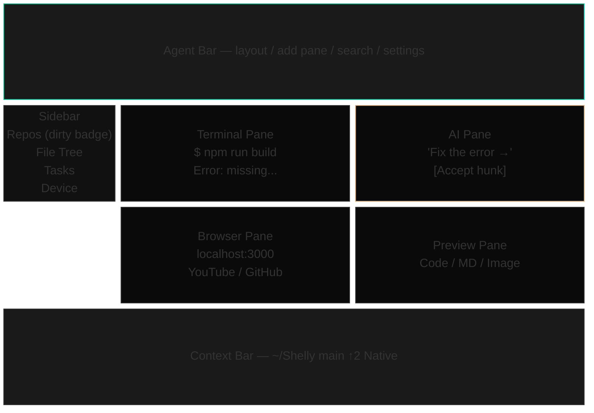
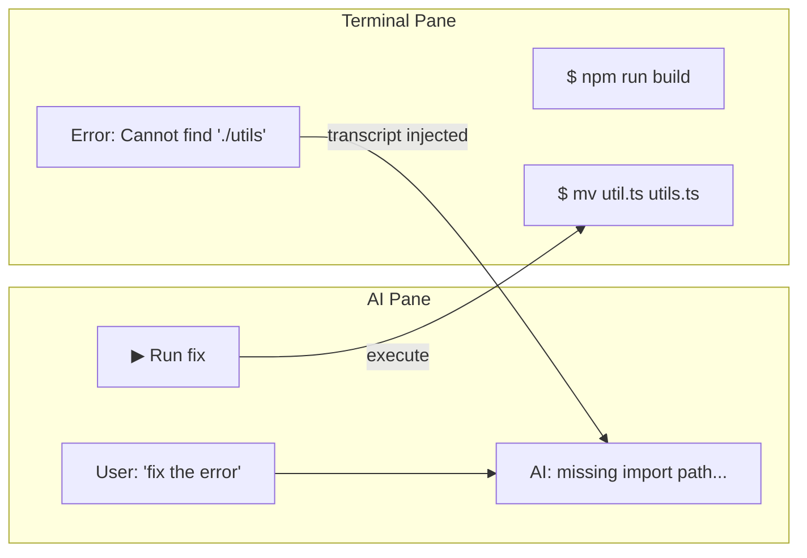
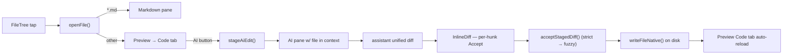
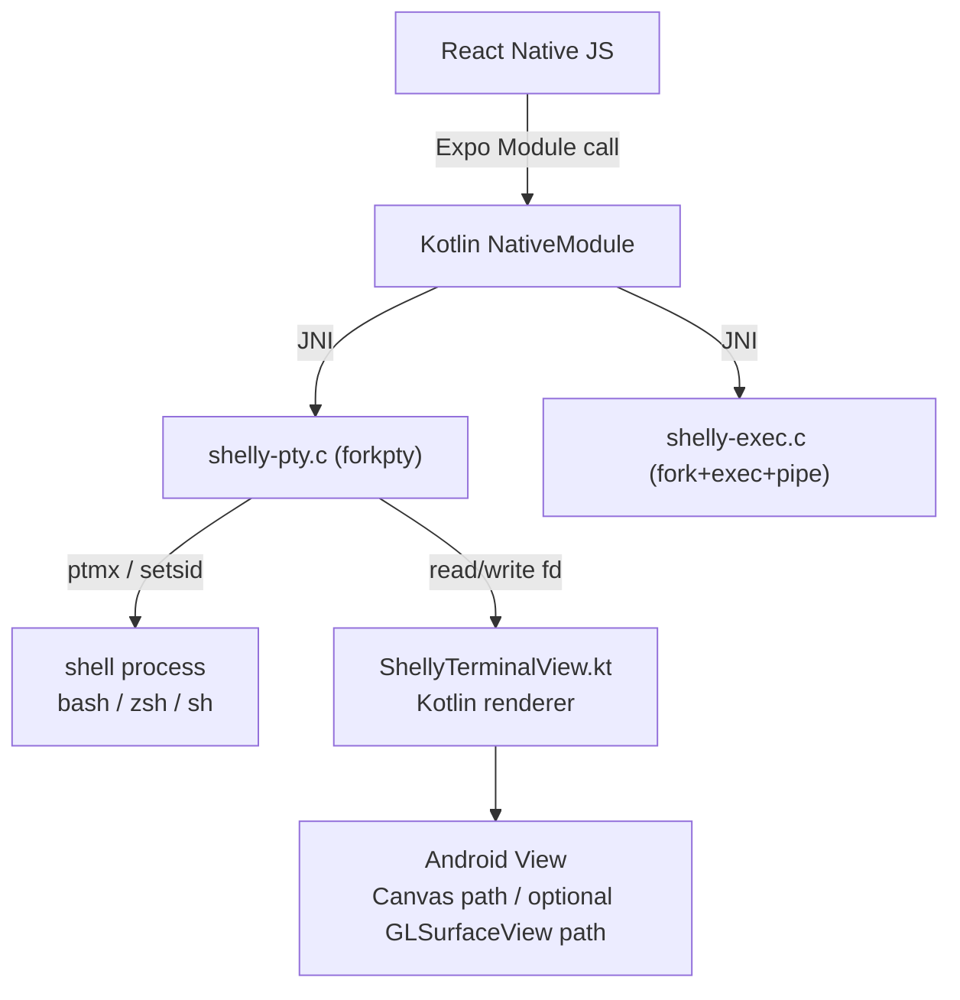
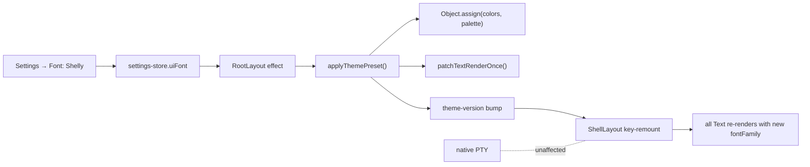

<p align="center">
  
</p>

<h1 align="center">Shelly</h1>

<h3 align="center">
  <code>Terminal + AI + Browser + Markdown + Preview</code><br>
  <sub>A native Android terminal IDE for running the real Codex CLI in an app-owned PTY, with API-backed AI agents — Gemini, Cerebras, Groq, Perplexity, and local models — plus Git, Bash, Python, and editors bundled in the APK.<br>
  No Termux install, no distro bootstrap, no separate package manager setup. No WebView terminal, no remote IDE bridge.<br>
  Open the app, authenticate your own AI accounts, and work in local multi-pane terminals on Android.</sub>
</h3>

<p align="center">
  <a href="https://github.com/RYOITABASHI/Shelly/actions/workflows/build-android.yml"></a>
  
  
  
  
  
  <a href="https://buymeacoffee.com/ryo1221"></a>
</p>

<p align="center">
  
</p>

<p align="center">
  <a href="#see-it-run"><b>Demo</b></a> &nbsp;&middot;&nbsp;
  <a href="#quick-start"><b>Quick Start</b></a> &nbsp;&middot;&nbsp;
  <a href="#why-shelly"><b>Why Shelly?</b></a> &nbsp;&middot;&nbsp;
  <a href="#features"><b>Features</b></a> &nbsp;&middot;&nbsp;
  <a href="#architecture"><b>Architecture</b></a> &nbsp;&middot;&nbsp;
  <a href="#status"><b>Status</b></a> &nbsp;&middot;&nbsp;
  <a href="#contributing"><b>Contributing</b></a> &nbsp;&middot;&nbsp;
  <a href="#support"><b>Support</b></a>
</p>


<br>

---

## See it run

**An AI coding CLI running natively on Android with slash-command autocomplete**

https://github.com/user-attachments/assets/dce5e69d-c8f0-456b-b011-82908dd72c5c

**AI reading a runtime error and suggesting the fix in real time**

https://github.com/user-attachments/assets/113ec26e-d289-4a06-a6d8-ef48158e874c

No Termux. No root. No remote dev server. A real AI coding CLI — today, OpenAI Codex — invoking on Android, plus an API-backed AI pane that reads terminal output and produces a one-tap fix.

> The clip above is from an earlier build. The supported foreground CLI in the current release is **Codex**; see [Status](#status).

<br>

---

## Why Shelly?

Termux is a terminal. ChatGPT is an AI chat. Replit is a cloud workspace. Desktop AI coding CLIs are desktop-first.

Shelly is the workspace that connects those pieces on the Android device you already carry: local terminal work, app-owned native PTYs, Codex CLI, AI panes, browser/docs, previews, and background API agents.

### The copy-paste problem

You're running an AI coding tool in a terminal — Codex, or any other AI CLI. It throws an error. You copy it. You switch to ChatGPT. You paste. You ask "what went wrong?" You read the answer. You copy the fix. You switch back. You paste. You run it.

**Seven steps. Every single time.**

This is the daily workflow of every developer using CLI-based AI tools. The terminal and the AI live in different worlds, and *you* are the copy-paste bridge between them.

**Shelly puts the terminal and the AI side by side. The AI reads your terminal output automatically.**

Say **"fix the error on the right"**. Shelly reads the terminal output, explains the error, and generates an executable command. Tap **[Run]** and the fix lands directly in the Terminal pane.

No copy. No paste. No tab switching. Zero friction.

**Three levels of value:**

- **Single pane:** a native terminal that is faster, smarter, and more usable than Termux alone — with inline content blocks, autocomplete, syntax highlighting, and clickable errors.
- **Split panes:** terminal + AI side by side — the AI reads what the terminal shows and executes fixes with one tap. No copy-paste bridge needed.
- **Full layout:** sidebar + up to 4 live panes + agent bar — a mobile IDE. Browse docs in the browser pane, preview code or markdown on the right, use API-backed agents in the background, and keep your terminal front and center.

---

## Important Android Notes

- **APK is ~700 MB** because Shelly bundles real tools, not shims. bash,
  Node.js, Python 3, git, curl, ripgrep, jq, tmux, vim, less, sqlite3,
  make, ssh — plus the OpenAI Codex CLI runtime — ship inside the APK.
  No Termux, no repository server, no package manager bootstrap. First
  launch extracts the binaries into app-private data.
- **All files access** is requested on first launch so `/sdcard` works
  the way a desktop terminal expects (`cd /sdcard/Download`, editing
  files there, etc.). Scoped Storage without this permission silently
  blocks writes. You can refuse — Shelly still works inside its own
  sandbox, but `/sdcard` paths will `Permission denied`.
- **LD_PRELOAD + /system/bin/linker64** is how Shelly runs Linux-layout
  binaries on Android bionic (SELinux blocks direct execve on
  app-private ELFs). The wrapper rewrites `/bin/X` and `/usr/bin/X` to
  `/system/bin/X` and routes app-bundled ELFs through `linker64`. Source
  is in `modules/terminal-emulator/android/src/main/jni/exec-wrapper.c`.
- **Not Termux-compatible by design.** Shelly does not use Termux
  packages, Termux paths, or Termux's prefix assumptions. If you already
  have Termux installed, Shelly still bundles its own copies of
  everything. No conflict, but also no sharing.

---

## Quick Start

### Install

Download the current Android APK from [**GitHub Releases**](https://github.com/RYOITABASHI/Shelly/releases). The rolling `android-latest` release is the source of truth for the newest Shelly build; older semver tags remain historical snapshots.

After the first install, Shelly can update itself from inside the app: open the cloud-download button in the top bar or **Settings → Updates**. Shelly reads the public `android-latest/latest.json` manifest, compares Android `versionCode`, downloads the APK to `/sdcard/Download/shelly-update-<versionCode>/`, verifies SHA-256, then opens Android's package installer. Android still asks you to confirm the install because Shelly is distributed outside the Play Store.

Expo OTA is disabled for release APKs. JS, native, and bundled-tool changes ship together through a new APK so the installed binary and app code stay in sync.

### Build from source

```bash
git clone https://github.com/RYOITABASHI/Shelly.git && cd Shelly
pnpm install && pnpm android
```

**Requirements:**

- Android device
- Node.js 20+ (CI currently builds on Node 20)
- pnpm
- Android NDK 26.1.10909125 (or an Android SDK/Gradle setup that resolves that pinned NDK)

Expo Go is not supported — Shelly uses native Kotlin/C modules.

Termux is not required. Shelly ships with bash, Node.js, Python 3, git, curl, sqlite3, tmux, vim, less, jq, make, and ripgrep. For tools beyond the bundled set, Termux can be used alongside Shelly.

### First launch

On first launch Shelly asks for **All files access** so the terminal can read scripts in `/sdcard/Download` and anywhere else on your phone. Tap **Allow** and you're done — `source /sdcard/Download/foo.sh` just works. Shelly is distributed through GitHub Releases for now; Play Store / F-Droid submission is still future work.

### Configure AI

After that, open **Settings → API Keys** (or run `shelly config` from the terminal pane) to paste API keys for Gemini, Cerebras, Groq, Perplexity, OpenAI-compatible local servers, or other explicit API providers. Keys are stored in `expo-secure-store` and never written to logs.

### Sign in

Shelly's foreground AI CLI is **Codex**. Everything else is an API provider you configure with a key.

| Surface | How to sign in | Notes |
|---|---|---|
| **Codex CLI** (ChatGPT subscription) | Run `codex`, or `codex-login --open` directly | The supported foreground CLI. If `~/.codex/auth.json` is missing or invalid, the `codex` wrapper starts Shelly's device-code login, opens the OpenAI device-code page in the in-app Browser Pane, writes `~/.codex/auth.json` (mode `0600`) on success, then launches the normal Codex TUI. No OpenAI API key required — this rides your ChatGPT subscription. |
| **API providers** (Gemini, Cerebras, Groq, Perplexity, local) | **Settings → API Keys** or `shelly config` | Paste a key per provider for AI-Pane / `@mention` / `@team` / background-agent use. Keys live in `expo-secure-store`. Local/OpenAI-compatible servers need only a base URL. |

> **Codex login note.** `codex /login` inside the REPL is not the supported path on Shelly. Use bare `codex` and let Shelly's wrapper launch device-code auth, or run `codex-login --open` from bash.

### Bundled Shelly commands

| Command | Use |
|---|---|
| `codex` | Launch the foreground Codex TUI in the native terminal. If auth is missing, Shelly starts the device-code login flow first. |
| `codex-login --open` | Start ChatGPT subscription device-code auth and open the verification page in Shelly's Browser Pane. |
| `shelly-doctor` | Check shell/native binary presence, bundled Codex binaries, JS dispatcher, local LLM endpoints, and Codex auth file presence. |
| `shelly-codex-diagnose` | Run deeper Codex smoke/canary/edit/patch diagnostics. |
| `shelly-update-clis codex --check-only` | Probe the active Codex runtime. Runtime installs are normally driven by the Updates UI. |
| `shelly-cs` / `cs` | GitHub Codespaces helper commands. |

---

## Runtime model

Shelly's headline advantage is the runtime itself: a native PTY and a managed Codex CLI running in the same on-device shell as your files, with API-backed agents layered on top — not a WebView terminal, not a remote IDE client.

If your AI coding CLI workflow stalled in Termux, proot, or another Android terminal setup, Shelly gives you a maintained on-device environment built around the constraints of real Android devices (bionic libc, `linker64` exec rules, SELinux on `app_data_file`).

No fragile terminal stack. No WebView terminal crashes. No copy-paste-driven workflow.

- **Native execution path** — Codex runs through Shelly's app-owned native PTY (JNI `forkpty`), not a remote bridge or socket terminal.
- **Managed latest, not blind latest** — Shelly ships a pinned Codex runtime in each APK, and the Updates UI can install a newer verified Codex runtime from the rolling `codex-runtime-latest` release without waiting for the next APK.
- **Visible state** — the app can show recent terminal logs, so version drift and startup failures are easier to debug on the device itself.
- **Compliance boundary** — Codex is a foreground, user-controlled terminal CLI. AI-Pane / background automation uses explicit API providers; it does not run a hidden subscription worker.

This is the part that makes Shelly more than a terminal skin. It is the reason the app can ship a fast-moving CLI on Android without turning the user into the update mechanism.

### Release surface

| Surface | Status | What that means |
|---|---|---|
| **Codex CLI** | Supported | The foreground CLI. Bare `codex` launches the normal Codex TUI after Shelly verifies or creates `~/.codex/auth.json` through in-app device-code auth, running over the native PTY. |
| **AI Pane / background agents** | Supported through APIs | Uses configured providers: Gemini API, Cerebras, Groq, Perplexity, and local OpenAI-compatible servers. Provider-key based, no hidden subscription reuse. |
| **Gemini API** | Supported where configured | Available for the AI Pane, `@gemini` routing, `@team`, multimodal/API-backed tasks, and background agents when a Gemini API key is set. (This is the API provider — there is no bundled Gemini CLI.) |

---

## What Shelly is not

Shelly is not a Termux skin, a WebView terminal, or a remote IDE client. It owns the Android terminal stack inside the app, runs Codex on-device in the same shell as your files, and layers API-backed agents next to that terminal instead of forcing you through copy/paste or a cloud workspace.

No Termux install. No proot. No ttyd. No remote bridge.

---

## Features

> Everything listed in this section is working in the current build. Anything not yet shipped is listed under [Coming Soon](#coming-soon) further down.

### Highlights

| | |
|---|---|
| **Cross-pane intelligence** | Say "fix the error." AI reads your terminal, suggests a fix, one tap to run. Zero copy-paste. |
| **AI Edit golden path** | Tap a file in the sidebar → preview it → hit `[✨ AI]` → describe the change → accept per hunk → the file is rewritten on disk, the preview reloads automatically. |
| **Codex apply_patch on-device** | Codex file edits land through the agent's native patch tool on Android, not a shell-only fallback. |
| **Native PTY (JNI forkpty)** | Kotlin + C, direct PTY fd, no TCP/socket bridge — an embedded native terminal, not a WebView terminal. |
| **Batteries included** | bash, Node.js, Python 3, git, curl, sqlite3, tmux, vim, ripgrep, jq ship inside the APK. Termux not required. |
| **5 pane types** | Terminal, AI, Browser (+ background audio), Markdown, Preview. Split up to 4 live panes freely. |
| **Multi-agent AI** | API-backed Gemini, Cerebras, Groq, Perplexity, Local LLM, plus the foreground Codex terminal CLI. Auto-routed or `@mention` where supported. |
| **Local LLM that holds its own** | Qwen3.5 models run on-device through the bundled llama.cpp / llama-server flow, with Qwen3.5-4B as the high-end default and Qwen3.5-9B available when quality matters more than responsiveness. |
| **Codex on Android** | Shelly keeps Codex on a managed-latest path without trusting upstream blindly: each APK bundles a pinned runtime, the Updates UI can promote verified runtime releases, and Reset falls back to the bundled runtime. Codex runs over the native PTY with a Shelly-owned device-code login wrapper. No proot, no root. |
| **Color themes** | Blue / Red / Purple palettes run on the existing preset IDs, so runtime swaps keep your shell alive without settings migration. |
| **Voice input** | Speak your commands or AI prompts. Groq Whisper handles transcription, then VoiceChain routes the text through the same input router the keyboard uses. |

<details>
<summary><strong>Layout System</strong></summary>

- **Single-screen layout** — AgentBar (top) + Sidebar (left, collapsible) + PaneContainer (center) + ContextBar (bottom)
- **5 pane types** — Terminal (native PTY), AI (streaming + context injection), Browser (WebView + bookmarks + background audio), Markdown (viewer), Preview (Code / Image / PDF / CSV / Markdown renderers)
- **Recursive binary split tree** — any leaf can split horizontally or vertically, up to 4 live panes; drag the accent-green grip to resize, double-tap it to restore 50/50
- **Layout presets** — Single Terminal / Terminal + AI / Terminal + Browser / 3-Way Triple, all reachable from the Command Palette
- **Pane-type pill** — header left shows `[TERMINAL ▾]` / `[AI ▾]` / …; tap to change the pane type in place
- **CLI tab strip inside terminal panes** — multiple shell tabs per pane, `[● SHELL][+]`, close `×` on non-last tabs
- **Empty-pane recovery** — the last pane cannot be closed; if the tree ever empties, a 3-button CTA (Terminal / AI / Browser) brings it back
- **ContextBar** — always-visible footer showing cwd, git branch, and connection status

</details>

<details>
<summary><strong>Cross-Pane Intelligence</strong></summary>

- **"Fix the error on the right"** — AI reads the current terminal transcript and responds with executable fixes
- **ActionBlock** — code blocks in AI responses get `[▶ Run]` buttons that dispatch to the active terminal pane
- **Pane-aware terminal selection** — in split layouts, the AI pane prefers the terminal immediately to its left, then the focused terminal, then the first terminal
- **Real-time terminal awareness** — AI pane snapshots the terminal transcript on dispatch so the model sees what you just saw
- **Terminal-safe context** — ANSI/OSC/control sequences and TUI redraw noise are stripped before injection; terminal output is treated as untrusted evidence, not instructions
- **Local LLM compaction** — `@local` keeps important header/status/error lines and the recent tail so small on-device models still see the useful terminal state
- **Error-file auto-stage** — when terminal output references a file path, Shelly can stage that file so an AI diff can be accepted directly
- **CLI Co-Pilot** — in-flight translation of output, approval prompt explanations, session summaries
- **Approval Proxy** — terminal `[Y/n]` prompts are lifted into chat-style `Approve / Deny / Ask AI` buttons so you never type blind 'Y'
- **Error Summary** — detected errors surface as persistent chat bubbles with `[Suggest Fix]`
- **Auto-savepoint** — every edit is auto-committed to a hidden git index so you can revert to any point with one tap
- **Pre-commit secret scan** — API keys, private keys, and other secrets are blocked before they land in a savepoint commit

</details>

<details>
<summary><strong>AI Edit — file edit with Accept / Reject</strong></summary>

- **Staged file** — tap a file in the FileTree; it opens in the Preview pane's Code tab. The `[✨ AI]` toolbar button stages the file in the AI pane's context.
- **Dispatch** — write "make the first function Japanese-comment" (or anything) and send. Shelly's system prompt asks the model to respond with a unified diff.
- **InlineDiff** — the assistant reply is scanned for unified diff blocks and each hunk is rendered with `+` / `-` / context coloring plus Accept / Reject buttons.
- **Per-hunk accept writes to disk** — accepting one hunk calls `acceptStagedDiff()` with a re-serialised single-hunk diff; the file is rewritten via the native `writeFileNative` bridge and the Preview pane auto-reloads.
- **Fuzzy re-anchor** — if the `@@ -N` line numbers are stale (because a previous hunk already edited the file on disk), the applier searches forward for the hunk's leading context block so successive hunks still land.
- **Accept All** — takes the same write-back path but applies every pending hunk in one pass.

</details>

<details>
<summary><strong>Terminal Enhancements</strong></summary>

- **Fig-style autocomplete** — top-level commands with subcommand and flag completion, rendered as an inline popup
- **Syntax highlighting** — terminal output colorized by content type
- **Clickable paths and errors** — tap a file path or stack trace line to jump to it
- **Inline content blocks** — JSON, markdown, images, and tables rendered inline inside the terminal output (Command Blocks)
- **CLI notifications** — long-running commands surface a system notification when they complete
- **SmartKeyBar** — 5 context-adaptive key sets (Default / Vim / Git / REPL / Navigate), swipe to switch
- **Immortal sessions** — tmux keeps your shell alive when the app is backgrounded; resume any session by name
- **Japanese input in terminal** — compose CJK characters directly in the terminal pane
- **Readable terminal glyphs** — the native Kotlin terminal view renders the PTY grid with JetBrains Mono so lowercase, columns, and code output stay legible
- **Atomic paste** — all paste paths converge on `TerminalEmulator.paste()`, which wraps payloads in bracketed-paste markers (`\e[200~..\e[201~`) unconditionally. IME multi-line or ≥16-char commits, middle-click mouse paste, and the CommandKeyBar **Paste** key all reach the same normalizer; multi-line and complex one-liners arrive as one event so readline executes only the trailing newline.

</details>

<details>
<summary><strong>AI Pane</strong></summary>

- **Multi-agent routing** — the router picks the best AI for the task; override with `@mention`
- **@mention** — direct AI Pane providers are `@gemini`, `@cerebras`, `@groq`, `@perplexity`, and `@local`; utility routes include `@team`, `@agent`, `@git`, `@open` / `@browse`, `@plan`, `@arena`, and `@actions` / `@ci`. There is no `@claude` — Claude Code is not a current provider. Codex remains available as the foreground terminal CLI via `codex`.
- **Terminal context injection** — the AI always has access to the current terminal transcript without you pasting anything
- **InlineDiff with per-hunk write-back** — see above
- **Voice input** — long-press the mic in the terminal action bar to open VoiceChat; speech → Groq transcription → AI → TTS response
- **Local LLM support** — use the built-in GGUF catalog and llama.cpp / llama-server controls, then route via `@local` for fully on-device inference. Qwen3.5-4B Q4_K_M is the high-end default, Qwen3.5-9B is available for quality-focused runs, and Qwen 2.5 1.5B remains the low-memory fallback.

</details>

<details>
<summary><strong>Browser Pane</strong></summary>

- **Full WebView** — navigate any URL inside a pane; keep docs open next to your terminal
- **Bookmarks** — save and organize URLs; preset icons for YouTube, X, GitHub, and `localhost:*`
- **Background audio** — audio keeps playing when you switch panes
- **Link capture** — share a URL to Shelly from any Android app; it opens in the browser pane
- **Desktop UA toggle** — `📱` / `🖥` button in the URL row swaps the user agent so desktop-only sites behave
- **Video fullscreen** — six detection paths (W3C / WebKit / video element / monkey-patched APIs) catch YouTube-style fullscreen and maximize the pane, hiding the system nav bar

</details>

<details>
<summary><strong>File Tree</strong></summary>

- **Active-repo file list** — `ls -1pa` listing for the current working directory with per-extension icon coloring (`.tsx` sky, `.ts` blue, `.json` amber, `README.md` red, …)
- **Search** — incremental filter over the current directory
- **Open actions** — tap a Markdown file to open the Markdown pane, tap anything else to open the Preview pane's Code tab
- **Create / Rename / Delete** — `+` file and `+` folder buttons next to the search field; long-press a row for `Rename / Copy path / Delete`; modals use the active app palette
- **Breadcrumb** — tap the `..` row to go up

</details>

<details>
<summary><strong>Preview Pane</strong></summary>

- **Code tab** — per-file syntax-highlighted view with line numbers; the `[✨ AI]` button stages the current file for AI Edit
- **Markdown renderer** — `react-native-markdown-display` plus the Shelly palette
- **Image / PDF / CSV renderers** — inline viewers for common non-code attachments
- **Git diff view** — `git diff <file>` shown in the Code tab with neon `+` / `-` coloring
- **Recent files** — quick switcher inside the Preview header

</details>

<details>
<summary><strong>Sidebar</strong></summary>

- **Repositories** — list of bound repo paths; tap to switch; the active repo shows an amber badge with the number of uncommitted files, polled every 20 seconds from `git status --porcelain`
- **File Tree** — see above; embedded as a section so it flexes with the sidebar height
- **Tasks** — recent background-agent runs with duration and status
- **Device** — quick-access folders (`~`, `/sdcard/Download`, …) that re-bind the file tree in one tap
- **Ports** — designed to list loopback / wildcard listeners and open `http://localhost:<port>` in the Browser pane. Android 10+ SELinux currently blocks the `/proc/net/tcp{,6}` reads for normal apps, so this remains tracked as a platform limitation in [Status](#status).
- **Profiles** — saved SSH connections. Tap to insert `ssh -i KEY user@host -p PORT` into the active terminal pane; long-press to edit or delete; `Import from ~/.ssh/config` bulk-adds hosts. Key-file auth only — no passwords or passphrases are persisted.

> **Cloud storage?** Shelly deliberately doesn't ship a Google Drive / Dropbox / OneDrive UI. A terminal app should lean on the tools that already solve this — install [`rclone`](https://rclone.org) from your package manager, run `rclone config` once, and mount or sync any of 40+ cloud backends from the terminal pane.

</details>

<details>
<summary><strong>Command Palette</strong></summary>

Opens from the search icon in the top bar (or from the AgentBar's git badge). Fuzzy search across every registered action, plus a persistent **Recent** list of the last five you ran.

Currently registered:

- **Settings** — open the terminal-style Settings TUI
- **Terminal** — Clear / New session / Restore tmux / Tmux attach
- **Git** — Status / Diff / Log / Add all / Commit / Push / Pull --rebase *(routed through the active terminal pane's `pendingCommand` channel)*
- **Panes** — Add Terminal / AI / Browser / Markdown / Preview
- **Layouts** — Single Terminal / Terminal + AI / Terminal + Browser / 3-Way Triple
- **Theme presets** — Blue / Red / Purple
- **Font presets** — Silk / 8bit / Mono and legacy editor palettes
- **Voice** — Open dialogue (VoiceChat modal)
- **Snippets** — first 20 entries from your snippet store, each dispatches to the terminal
- **Package Manager** — bundled tools status

</details>

<details>
<summary><strong>Theme &amp; Fonts</strong></summary>

- **Color presets** — Blue is the default cool palette, Red is red-orange chrome, and Purple is purple with neon green accents.
- **Visible presets** — Settings and the Command Palette expose the three color themes. Legacy and editor palette IDs remain accepted for old saved settings but are no longer the primary UI surface.
- **Runtime swap** — presets are swapped by mutating the live `colors` object in place (identity preserved) and bumping a theme-version store that key-remounts the shell layout. PTY sessions survive the switch — your vim stays open.
- **Single-family rendering** — every Text is forced through JetBrains Mono regardless of its `fontWeight`, keeping UI and terminal typography consistent.
- **Text.render monkey-patch** — `Text.defaultProps.style` is replaced (not merged) when a child passes its own `style`, which would otherwise let 100+ call sites escape the theme font. The patch prepends `{ fontFamily }` to every Text's style array so the preset font reaches every call site without touching them.
- **Neon glow** — eight per-color `textShadow` styles (teal / blue / sky / purple / pink / green / red / amber) for the mock's "reading terminal" vibe
- **Haptic toggle** — per-interaction feedback on/off

</details>

<details>
<summary><strong>Git Integration</strong></summary>

- **Dirty badge** — AgentBar (amber pill, global) and Sidebar (on the active repo row) both show the uncommitted-file count, polled every 20 seconds by a single writer in `useGitStatusStore`. Tapping the AgentBar badge opens the Command Palette filtered toward git actions.
- **Command Palette** — the seven git actions listed above
- **Auto-savepoint** — background git-based save system (`lib/auto-savepoint.ts`) with secret pattern scanning before each commit
- **Git diff preview** — Preview pane Code tab renders `git diff <file>` with the neon diff palette

</details>

<details>
<summary><strong>Settings, API Keys, Background Agents</strong></summary>

- **Inline API key editor** — Gemini / Cerebras / Groq / Perplexity and local/OpenAI-compatible API keys in the Settings dropdown with masked display and per-row `EDIT / CLEAR / SAVE / CANCEL`. Keys live in `expo-secure-store`.
- **Settings TUI** — full settings also accessible via a terminal-style text UI
- **Command safety** — regex-based 5-level risk assessment (seatbelt, not firewall — see [Security](#security))
- **Workspace isolation** — per-project cwd / env / AI context
- **Background agents** — `@agent list`, `@agent status`, `@agent run <name>`, `@agent stop <name>`, `@agent history <name>`, or `@agent <natural language>` to create one. Scheduled agents run through AlarmManager when configured.
- **Managed Codex runtime updater** — the Updates UI reads the public `codex-runtime-latest/codex-runtime.json` manifest, downloads the tarball, verifies SHA-256, smoke-tests both `codex_tui` and `codex_exec` with `--version`, then promotes the runtime under `~/.shelly-runtime/codex/current`. The new runtime is used by newly opened terminal tabs; **Reset** falls back to the APK-bundled runtime.
- **`shelly-doctor`** — diagnostic command that checks shell/native binary presence, bundled Codex binaries, JS dispatcher, local LLM endpoints, and whether `~/.codex/auth.json` is present; run it when something feels broken

</details>

### Codex Runtime

- **Native runtime** — the npm `@openai/codex` package is only part of the JS dispatcher story. Release APKs bundle pinned Android-native `codex_exec` / `codex_tui` binaries from `.ci-versions/`, and runtime updates install the same shape under `~/.shelly-runtime/codex/current`.
- **Managed promotion** — a new runtime candidate is promoted only after download, SHA-256 verification, extraction, executable checks, and matching `--version` smoke checks for both `codex_tui` and `codex_exec`.
- **Repair / reset path** — if the app-data runtime is broken or unwanted, the Updates UI can repair it from the latest runtime release or reset to the APK-bundled Codex runtime.

---

## Status

| Area | State |
|---|---|
| Native PTY, sessions, tmux revival | ✅ shipping |
| Multi-pane layout (5 types, splits, presets, drag resize, empty-state CTA) | ✅ shipping |
| Atomic paste (bracketed-paste wrap when guest opts in via DECSET 2004, single `TerminalEmulator.paste()` choke point, IME chunk-split coalesced) | ✅ shipping (bugs #91, #94, #97, #106) |
| `/sdcard` access via `MANAGE_EXTERNAL_STORAGE` (first-launch grant flow) | ✅ shipping (bug #92) |
| `bash` wrapper at `$HOME/bin/bash` for shebangs and `bash script.sh` | ✅ shipping (bug #93) |
| `execSubprocess` JNI read loop (EAGAIN vs EOF distinction) | ✅ shipping (bug #70) |
| AI Edit golden path (stage → diff → per-hunk accept → disk writeback) | ✅ shipping, fuzzy re-anchor for successive hunks |
| FileTree CRUD (create / rename / delete / copy path) | ✅ shipping |
| Command Palette — settings, terminal, git, panes, layouts, theme, font, voice | ✅ shipping |
| Browser fullscreen, desktop UA toggle, link capture, bookmarks | ✅ shipping |
| Theme presets — Blue / Red / Purple, with legacy preset IDs accepted for saved settings (runtime swap, Text monkey-patch) | ✅ shipping |
| AgentBar + Sidebar git dirty badge (single-writer poll) | ✅ shipping |
| Sidebar Add Repository existence check + Alert on ghost path | ✅ shipping (bug #73) |
| AI pane Local LLM routing (URL-driven, no enable toggle) | ✅ shipping (bug #68) |
| Voice dialogue (VoiceChat + VoiceChain + TTS) | ✅ implemented, device smoke-test pending |
| Immortal sessions (tmux keep-alive) | ✅ implemented, device smoke-test pending |
| Local LLM via llama.cpp `@local` (Settings · Integrations · Local LLM: catalog, download, start/stop) | ✅ shipping |
| MCP Servers (Settings · Integrations · MCP Servers) | ✅ shipping |
| Codex CLI launch/auth | ✅ supported; bare `codex` runs over the native PTY, using Shelly device-code auth before TUI launch |
| Codex managed native runtime (`codex_exec` / `codex_tui` staged under `~/.shelly-runtime/codex/current`, `--version` smoke-tested, repair / reset to bundled runtime) | ✅ managed latest |
| Gemini API in AI Pane / `@gemini` / `@team` / background agents | ✅ available when a Gemini API key is configured |
| Background agents — `@agent` registration, AlarmManager scheduling, Sidebar Tasks list with run-now / delete | ✅ wired, AlarmManager end-to-end smoke test pending |
| Sidebar Ports monitor (`/proc/net/tcp` → tap to open in Browser pane) | ⚠ Android 10+ SELinux denies both `/proc/net/tcp{,6}` reads and `NETLINK_SOCK_DIAG` sockets from `untrusted_app`; tracked in `docs/superpowers/DEFERRED.md` (P1) — needs an alternative channel (e.g. a bundled privileged helper or system_server intent) in a future release |
| Sidebar SSH Profiles (key-file auth, ~/.ssh/config import, tap-to-connect) | ✅ shipping |
| Sidebar Quick Launch / Worktrees (one-tap CLI shortcuts) | ✅ shipping for Codex |
| In-app Android APK updates (`android-latest/latest.json`, SHA-256 verification, Package Installer handoff) | ✅ shipping |
| In-app Codex runtime updates (`codex-runtime-latest/codex-runtime.json`, smoke-tested runtime promote / reset) | ✅ shipping |
| Cloud storage | 🚫 out of scope — use `rclone` from the terminal pane |
| App icon | ✅ shipping |
| Distribution channels (Play Store / F-Droid) | 🟡 GitHub Releases only for now; current Android release is the rolling `android-latest` build |

Full validation checklist: [`docs/superpowers/specs/2026-04-13-validation-checklist.md`](docs/superpowers/specs/2026-04-13-validation-checklist.md)

---

## Coming Soon

Parts of the app are written but not yet verified. These are on the short-term roadmap, not in the current build:

- **Play Store / F-Droid distribution** — the APK is published via GitHub Releases only; store submission flow not yet done
- **End-to-end device validation** for voice dialogue, immortal sessions, and background agent AlarmManager scheduling — all wired but not yet smoke-tested on the target device
- **Snippet authoring UI** — the Command Palette shows the first 20 entries from your snippet store and dispatches them to the terminal, but the in-app create/import/edit flow was removed in an earlier cleanup pass. Snippets can still be added by editing `~/.shelly/snippets.json` directly or via `shelly config`.

---

## The Story

### I don't hand-write code.

I'm not an engineer by training — I'm a Creative Director. Every line in this repo was generated by AI under my direction, then reviewed, tested on-device, and shipped. What I bring is twenty years of product judgment about what belongs on a screen and what doesn't — and that turns out to be most of the job.

Every architectural decision in Shelly is mine. The code is not. It was created through conversation with [Claude Code](https://claude.ai/) on a Samsung Galaxy Z Fold6. I direct. The AI builds. No desktop. No laptop. Just a foldable phone and an AI that can execute commands.

The keyboard you see in the screenshots? I built that too. It's called [Nacre](https://github.com/RYOITABASHI/Nacre) — an Android IME written in Kotlin, also created entirely through AI conversation. I'm typing on it right now, inside Shelly, improving both apps simultaneously.

This is not a portfolio project. This is a tool I use every day to build things. If you find something that could be better, that's what the issue tracker is for.

### Why any of this exists

Mobile development never took off — not because phones lack computing power, but because the **input** and **interface** weren't designed for creation.

Chat apps (ChatGPT, Claude, Gemini) can *talk* about code, but they can't *run* it. Terminal emulators (Termux) can *run* anything, but they're hostile to anyone who isn't already a developer.

Shelly fills the gap. You type "make me a portfolio site" in the AI pane, and a real shell runs the commands, generates files, and shows you the results — right next to the terminal that produced them.

### Why every design decision is shaped like a question

Every feature in Shelly started as a frustration I had with existing tools:

- The cross-pane system comes from *"Why do I have to copy an error from one window and paste it into another?"*
- The native terminal comes from *"Why does the terminal die every time I switch apps?"*
- The approval proxy comes from *"An AI CLI is asking me to approve something in English. I don't know what it means."*
- The VoiceChain comes from *"I can't type on a phone keyboard fast enough to keep up with my ideas."*
- The layout system comes from *"Why can't I have a browser, a terminal, and an AI all on the same screen at the same time?"*
- The color theme presets come from *"Why do I have to choose between a usable UI and an aesthetically interesting one?"*

Every limitation became an innovation that engineers need just as much.

### Why native — the WebView pivot

Early versions used ttyd and a WebView. WebSocket connections dropped. Android's Phantom Process Killer terminated background processes. Every time you switched apps, the terminal was dead.

So I directed the AI to throw it all away and go native. Shelly now embeds a native terminal emulator — Kotlin code derived from Termux's own `terminal-emulator` library — connected to an app-owned PTY through a JNI C layer. No TCP terminal server. No WebSocket boundary. No ttyd process to drop.

For a React Native app this is an unusual architecture: an embedded native terminal emulator backed by an app-owned PTY via JNI `forkpty`, rather than a WebView or a socket bridge to an external terminal server.

### Who is this for?

- **Vibe Coders** — Lovable / Bolt / Replit Agent, but on your phone with a real terminal underneath
- **Mobile-first developers** — Codex CLI users and anyone serious about CLI-first AI coding workflows who want a proper multi-pane IDE around real local terminals
- **Non-engineers with ideas** — Shelly translates everything. Dangerous operations are blocked until you understand them

---

## Architecture

### Screen Layout



### Cross-Pane Intelligence



AI reads Terminal. Terminal executes AI. The user just talks.

### AI Edit Golden Path



Each step is a real module: `lib/open-file.ts`, `lib/ai-edit.ts`, `components/panes/InlineDiff.tsx`, `hooks/use-native-exec.ts`.

### Native PTY — JNI forkpty



Two JNI entry points for two different needs. **`shelly-pty.c`** owns interactive shells: it opens `/dev/ptmx`, calls `forkpty`-equivalent logic (`grantpt` + `unlockpt` + `setsid` + `execve` via `/system/bin/linker64`), and hands the master fd back to Kotlin for the terminal view to read. **`shelly-exec.c`** owns programmatic one-shots (`git status`, `ls`, file I/O, AI dispatch helpers): it does a vanilla `fork` + `exec` + `pipe` and returns `{exitCode, stdout, stderr}` synchronously, with an EAGAIN-aware read loop that distinguishes spurious select wakes from genuine EOF (bug #70 fix).

No TCP. No socket terminal server. No separate PTY helper daemon. Shells still run as normal forked child processes, while the PTY master fd is owned by the app and read directly from Kotlin via JNI.

### Runtime Theme Swap



The `colors` object is mutable and keeps the same identity, so every `import { colors as C }` consumer sees the new values without a code change. The Text monkey-patch handles font changes. The theme-version key-remount forces all rendered Text through the patch. PTY lives outside JS, so it's untouched.

---

## Built With

| Layer | Technology |
|-------|-----------|
| Framework | Expo 54 / React Native 0.81 |
| Language | TypeScript (strict) + Kotlin + C |
| UI | NativeWind (TailwindCSS 3) |
| State | Zustand |
| Navigation | expo-router v6 |
| Terminal | Native emulator (Kotlin, Termux-derived) + JNI forkpty (C, app-owned PTY) |
| Fonts | JetBrains Mono for app/terminal readability, with bundled legacy pixel fonts retained for compatibility |
| i18n | expo-localization + Zustand (900+ keys, EN/JA) |

---

## Contributing

This started as a personal tool. Community contributions are shaping it into a true OSS project.

**Looking for a first contribution?** Check the [`good first issue`](https://github.com/RYOITABASHI/Shelly/issues?q=is%3Aissue+is%3Aopen+label%3A%22good+first+issue%22) label. Unit tests are already wired through Jest; focused tests around routing, update manifests, command safety, and native bridge helpers are especially useful.

**Key files to explore:**

- `lib/input-router.ts` — the brain; classifies natural language into shell commands, AI requests, or `@mentions`
- `lib/command-safety.ts` — risk assessment engine; blocks dangerous commands with 5 severity levels
- `lib/auto-savepoint.ts` — watches for file changes and auto-commits; the "game save" system
- `lib/ai-edit.ts` — stage / apply / fuzzy-re-anchor unified diffs against the staged file
- `lib/theme-presets.ts` — palette + runtime preset swap + Text.render monkey-patch
- `components/panes/InlineDiff.tsx` — per-hunk Accept / Reject with write-back
- `modules/terminal-view/android/.../ShellyTerminalView.kt` — the native terminal renderer (Kotlin + Android Canvas)
- `modules/terminal-emulator/android/src/main/jni/shelly-pty.c` — the JNI forkpty layer

If you find something that could be better — a cleaner pattern, a performance optimization, a bug fix — **please open an issue or PR**. That's exactly why this is open source.

Read the contributing guide: **[CONTRIBUTING.md](CONTRIBUTING.md)**

---

## Vision

In two years, mobile terminals will be standard. The hardware is already here — 40+ TOPS NPUs, 12 GB of RAM, 7B-parameter models running on-device at interactive speeds — and the only thing missing is the interface. Shelly is a bet on that timeline.

When a full IDE runs in your pocket and the AI doesn't have to phone home, you get zero-cost assisted development, complete privacy, and the ability to ship real software from places no laptop reaches. The first person to ship a production app from a plane without wifi will be using something like this.

Shelly was built for that future. Local LLM routing is already wired. The native terminal is already there. The multi-agent routing already supports local models alongside cloud APIs. The layout system already handles the screen real estate of foldables and tablets.

The question isn't whether mobile development will happen. It's who builds the tools for it first.

---

## About the Creator

**RYO ITABASHI** — Creative Director at [Rebuild Factoryz](https://rebuildfactoryz.com/). Branding and design are my profession. Code is not.

I built Shelly because I wanted to use Claude Code on my phone, but Termux was too intimidating. So I made a chat interface that hides the terminal complexity while keeping its full power. Along the way, the foreground CLI shifted to Codex — Claude Code's Android compatibility moves faster than any third-party app can chase — but the original frustration stayed the same. Then I realized the real problem wasn't the terminal itself — it was the gap between the terminal and the AI. So I connected them. Then the WebView kept dying, so I directed the AI to replace the entire rendering layer with a native terminal emulator. Then I realized I needed a browser pane, a markdown viewer, a code preview, a sidebar, and a proper layout system to make it a real IDE.

I still don't hand-write code. I describe what I need, the AI builds it, and I decide whether it ships.

The keyboard in the screenshots is **Nacre** — a split-layout Android IME I built (also through AI) to solve the input problem on mobile. Shelly handles the interface. Nacre handles the input. Together, they make phone-only development actually possible.

**Both were developed entirely on a Samsung Galaxy Z Fold6, without ever touching a desktop computer.**

---

## Support

Shelly is a solo, self-funded project. If it saves you a Termux setup or makes phone development viable for you, a coffee goes a long way.

<p align="center">
  <a href="https://buymeacoffee.com/ryo1221"></a>
</p>

You can also support the project by:

- ⭐ Starring this repo
- 🐛 [Reporting bugs](https://github.com/RYOITABASHI/Shelly/issues)
- 🔧 Sending a PR — see [Contributing](#contributing)
- 💬 Sharing what you built with Shelly

GitHub Sponsors is also enabled via the "Sponsor" button at the top of this repo.

---

## Known Limitations

Shelly v5.3.8 is pre-release Android software. Here's what we know isn't perfect yet.

- **No offline mode by default** — Cloud AI features require an internet connection. Local LLM via `@local` works offline with the bundled catalog and llama.cpp / llama-server controls; Qwen3.5-4B Q4_K_M is recommended for high-end foldables, Qwen3.5-9B is the quality-focused option, and Qwen 2.5 1.5B is the low-memory option.
- **Additional tools beyond the bundle** — Shelly ships with bash, Node.js, Python 3, git, curl, sqlite3, tmux, vim, less, jq, make, and the GNU coreutils set. Notable tools **not** bundled include `busybox`, `watch` (procps-ng), `htop`, and most network daemons. If you need them, install Termux alongside Shelly or open a PR adding the binary to `modules/terminal-emulator/android/src/main/jniLibs/`.
- **`watch` is broken in the current release** — the bundled `watch` binary fails to invoke subcommands under Shelly's bionic environment and the watched command never actually runs, even though the header refreshes. Workaround: `while true; do clear; <cmd>; sleep 1; done`. Tracked as bug #34.
- **`busybox` is not bundled** — `busybox httpd`, `busybox nc`, and other applets return `command not found`. Use the standalone equivalents where available (`curl`, `nc` from the bundle, `python3 -m http.server`), or bundle `busybox-static` yourself. Tracked as bug #35.
- **`@team` routes to multiple APIs simultaneously** — this consumes credits on every provider at once; a cost warning is shown before execution.
- **Multi-hunk Accept against a partially-edited file** — per-hunk Accept uses fuzzy re-anchoring so successive hunks land, but if the AI's diff references context that has already been edited to something else, the hunk will be rejected with a toast asking you to regenerate.
- **Terminal font mismatch** — if a saved legacy theme looks wrong after upgrading, switch Settings → Display → Theme to one of the three color presets.
- **Codex CLI runs through Shelly-managed runtime routing** — Shelly prefers a healthy app-data runtime under `~/.shelly-runtime/codex/current`, then falls back to the APK-bundled runtime. If `codex --version` fails, run `shelly-doctor`, `shelly-update-clis codex --check-only`, or use **Settings → Updates → Repair Codex / Reset**.
- **Codex login uses an in-app device-code OAuth flow** — run bare `codex` or `codex-login --open` from any terminal pane. Shelly validates `~/.codex/auth.json`; if it is missing or invalid, Shelly opens the OpenAI verification page in the in-app Browser Pane, writes `~/.codex/auth.json` (mode `0600`) on success, then launches the normal Codex TUI. No OpenAI API key is required; this rides your ChatGPT Plus/Pro/Business/Enterprise subscription. The flow has a 15-minute device-code timeout — re-run if it expires. Verify with `shelly-doctor` (it reports whether `~/.codex/auth.json` is present).
- **`/sdcard` access requires MANAGE_EXTERNAL_STORAGE** — Android 11+ Scoped Storage blocks direct `open(2)` on `/sdcard` paths without this permission. Shelly asks for it on first launch; if you deny it, `source /sdcard/Download/foo.sh` will fail with `Permission denied`. Re-grant from system Settings → Apps → Shelly → Permissions → Files and media → Allow management of all files.
- **Gemini is API-only** — Gemini is available as an API provider (AI Pane, `@gemini`, `@team`, background agents) with a configured key. There is no bundled Gemini CLI and no interactive `gemini` login flow in this release.
- **Very large or binary pastes** — the paste path is a one-shot write into the PTY. Multi-megabyte clipboard payloads will take noticeable time and may stall the UI briefly; binary content (non-UTF-8 bytes, null characters) is not a supported transport mechanism and may corrupt the shell buffer. Use `curl -O` / `scp` / `/sdcard/Download/` drop-point for binary transfer.
- **Fold/rotate/split-screen during an active CLI session** — Shelly survives layout changes, but terminal state is not always persisted across an Android Activity recreate. Save or commit work before aggressive multitasking (fold ↔ unfold rapidly, split-screen drag while a foreground job is running). AI CLI streams specifically are best completed or interrupted (Ctrl-C) before rotating.

## Permissions

Shelly is a terminal app that runs shell commands, edits files, calls AI APIs, and stores credentials. That combination requires more Android permissions than a typical app. Here's why each exists, what happens if you deny it, and what alternatives exist.

| Permission | Why | If denied | Alternative |
|---|---|---|---|
| **MANAGE_EXTERNAL_STORAGE** | Lets the terminal read scripts in `/sdcard/Download` and other shared directories. The standard "adb push a file, source it from the shell" workflow requires this. | `source /sdcard/Download/*.sh` fails with `Permission denied`. Everything inside `$HOME` (the app's private data dir) still works. | SAF-based per-file import UI is planned for Play Store distribution (DEFERRED P3). For now, grant from Settings → Apps → Shelly → Permissions → Files and media → Allow management of all files. |
| **INTERNET** | AI API calls (Gemini, Groq, Perplexity, Cerebras, OpenAI-compatible/local servers) and CLI account/device-auth flows. Also used by runtime checks for CLI updates. | Cloud AI features and login/update flows stop working. Local LLM (`@local`) and all terminal features still work. | Use `@local` for fully on-device inference. |
| **POST_NOTIFICATIONS** | CLI completion notifications (long-running commands surface a system notification). | You won't see the "command finished" toast. | — |
| **FOREGROUND_SERVICE** | Keeps the terminal alive when the app is backgrounded. | Shell processes may be killed by the OS when you switch apps. | — |
| **RECORD_AUDIO** | Voice input (VoiceChat + VoiceChain). | Voice features are disabled. Typing works normally. | — |

Shelly is distributed via GitHub Releases for now, not Google Play or F-Droid yet. The `MANAGE_EXTERNAL_STORAGE` permission would require a Play Store all-files-access audit, which is why Play Store distribution is deferred until a SAF-based import path is available as a fallback.

---

## Security

Shelly runs commands on your device. The safety system is a best-effort layer, not a guarantee.

- **Security model** — Shelly is a normal Android app sandbox, not a hardened VM. Terminal commands and approved AI-agent actions run as the app uid and can read/write whatever the app can access.
- **Command safety is regex-based** — The 5-level risk assessment uses pattern matching. It catches common dangerous patterns (`rm -rf /`, `dd if=`, etc.) but is not a sandbox. Treat it as a seatbelt, not a firewall.
- **APK distribution uses CI release APKs** — GitHub Actions builds release APKs and publishes them to the rolling `android-latest` release. For production-grade signing guarantees, clone the repo and build with your own keystore. See [Build from source](#build-from-source).
- **Autonomous agents require explicit approval per action** — AI Pane and background actions run through explicit API providers with per-action command approval. There is no hidden subscription worker.
- **API keys are stored in SecureStore** — Keys are never written to logs or debug output. SecureStore uses Android Keystore encryption on supported devices.
- **`shelly-doctor`** — reports shell/native binary presence, bundled Codex binaries, JS dispatcher, local LLM endpoints, and whether `~/.codex/auth.json` exists. Run it when something feels broken.
- **Log redaction** — Shelly redacts common API key and token patterns before writing app debug logs. This is a guardrail, not permission to paste secrets into prompts or terminal output.
- **Convenience ≠ security** — Shelly combines shell execution, AI dispatch, file editing, API key storage, and broad storage access in a single app. This is powerful but means a compromise of any one layer could affect the others. Review the source, build from your own keystore, and treat Shelly as a development tool — not as a production server environment.

See [SECURITY.md](./SECURITY.md) for the threat model and private vulnerability reporting process.

---

## Privacy

- **User profile learning** — Shelly observes your command patterns and AI usage to personalize suggestions (`lib/user-profile.ts`). This data stays on-device in AsyncStorage. However, when you send a message to a cloud AI, the profile context is included in the API request to improve response quality. You can disable profile learning in Settings.
- **No telemetry** — Shelly does not phone home. No analytics, no crash reporting, no usage tracking. The only network traffic is your explicit AI API calls.
- **Local LLM mode** — For fully private usage, configure a local GGUF model through llama.cpp. Qwen3.5-4B Q4_K_M is the recommended high-end model; Qwen3.5-9B is available when quality matters more than responsiveness, and Qwen 2.5 1.5B is available for low-memory devices. All processing stays on-device.

---

## License

[GPLv3](./LICENSE) — Copyright (c) 2026 RYO ITABASHI

This project includes code derived from [Termux](https://github.com/termux/termux-app) (GPLv3), specifically the terminal emulator rendering layer.
